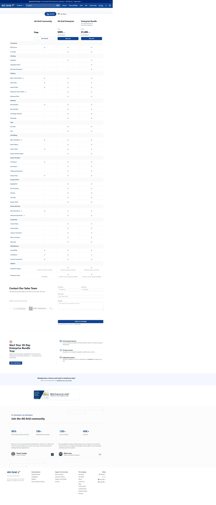

# Page text dump

Source: https://www.ag-grid.com/license-pricing



```
Beyond the Prompt
A one-day AG Grid & Bryntum conference • 19th May 26
Learn more
Products
Search
Ctrl K
Demos
Theme Builder
Docs
API
Community
Pricing
AG Grid Community
Free
Get started
AG Grid Enterprise
$999
Buy now
Enterprise Bundle
$1,498
Buy now
AG Grid
AG Charts
AG Grid Community

Free

Get started
AG Grid Enterprise

From

$999
USD

per developer

Buy now
Enterprise Bundle

AG Grid Enterprise &
AG Charts Enterprise

From

$1,498
USD

per developer

Buy now
AI Features
MCP Server
AI Toolkit
—
Charting
Sparklines
—
Integrated Charts
—
—
AG Charts Enterprise
—
—
Filtering
Basic Column Filters
Quick Filter
External Filter
Advanced Column Filters
—
Advanced Filter
—
Selection
Row Selection
Row Numbers
—
Cell Range Selection
—
Fill Handle
—
Cells
Formulas
—
Find
—
Cell Editing
Basic Cell Editors
Batch Editing
—
Undo / Redo
Advanced Select Editor
—
Import & Export
CSV Export
Excel Export
—
Clipboard Operations
—
Drag & Drop
Group & Pivot
Aggregation
—
Row Grouping
—
Pivoting
—
Tree Data
—
Master Detail
—
Server-side Data
Basic Operations
Advanced Operations
—
Accessories
Column Menu
—
Context Menu
—
Columns Tool Panel
—
Filters Tool Panel
—
Status Bar
—
Miscellaneous
Accessibility
Localisation
Custom Components
Support
Enterprise Support
—
Community support via GitHub
Enterprise support via Zendesk
Enterprise support via Zendesk
Perpetual License
—
MIT license
Including 1 year of updates (see EULA)
Including 1 year of updates (see EULA)
Contact Our Sales Team

Get help with pricing, explore use-cases for your team, and more

Millions use AG Grid every day:

First Name
Last Name
Work email
Message

By submitting this form you agree to our Privacy Policy.

Start Your 30-Day Enterprise Bundle Trial

Explore the full enterprise capabilities of AG Grid and AG Charts with a free 30-day trial licence — no restrictions, no watermarks.

Get a trial license

Full enterprise features
Access all advanced grid and charts features without console warnings or watermarks.

30 days of access
Enough time to evaluate integration, performance, and fit.

Engineering support
Get direct assistance from our developers via Zendesk throughout your trial.

Already have a licence and need to install your key?

Read our documentation on Installing Your Licence Key.

Which licences do I need?

Watch our short explainer video

For developers, by developers

Join the AG Grid community
90%

Of the Fortune 500 use AG Grid

1M+

Weekly NPM downloads

13K+

Stars on GitHub

40K+

Commits

There are a lot of component-based table libraries out there, but I believe AG Grid is the gold standard and is by far my favourite. AG Grid is perfect for building Enterprise Applications.

Tanner Linsley

Creator TanStack

If your application needs to display large amounts of data, we recommend AG Grid. Not only is it highly customizable and extensible, it’s also the fastest JavaScript grid on the planet.

Brian Love

Expert at Google Developers

© AG Grid Ltd. 2015-2026

AG Grid Ltd registered in the United Kingdom. Company No. 07318192.

Documentation
Getting Started
Changelog
Pipeline
Documentation Archive
Support & Community
Stack Overflow
License & Pricing
Support via Zendesk
Security
The Company
AG Charts
AG Studio
About
Contact Us
Blog
Privacy Policy
Cookies Policy
Modern Slavery
Sitemap
Follow
GitHub
X
YouTube
LinkedIn
```
