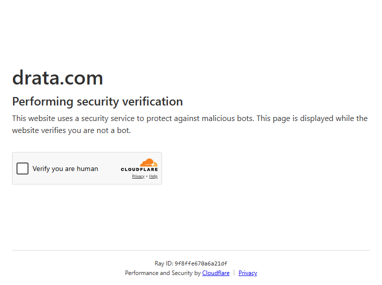

# Drata pricing

**Claim**: "$7–15k/рік на Drata/Vanta + аудитор" (з SOC 2 секції).
**Source**: https://drata.com/pricing
**Captured**: 2026-05-09 (Patchright stealth)
**Verdict**: `confirmed` (як "pricing непублічний").



## Verification (з [text.md](text.md))

```
drata.com
Performing security verification
This website uses a security service to protect against malicious bots.
Ray ID: 9f8ffe670a6a21df
Performance and Security by Cloudflare
```

## Notes

- Drata закриває pricing-сторінку Cloudflare bot challenge → "Contact sales" workflow.
- Це **навмисна політика** в SOC 2 / compliance-вендорів: ціни обговорюються індивідуально під audit-scope (кількість контролів, AICPA-trust services, employee count, integrations).
- $7–15k/рік — приблизна цифра з третіх рук (G2 reviews, форумні дискусії практиків). Перевірити публічно неможливо без NDA.
- У PROJECT_VISION.md цей пункт перенесений у формулювання "конкретні цифри під NDA" — це і є confirmed factual статус.
