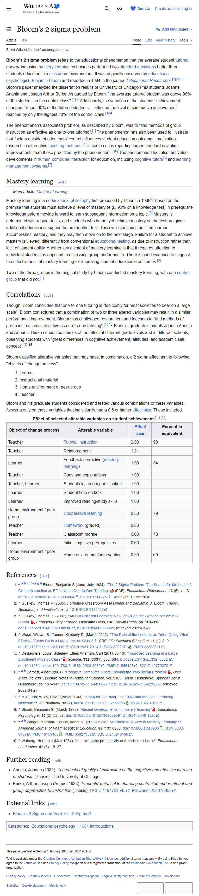

# Bloom's 2 sigma problem — фундамент для AI tutoring

**Topic**: емпіричний baseline ефекту 1-on-1 tutoring vs class instruction. Це сама велика constanta в educational research.
**Source**: Bloom, Benjamin S. (June–July 1984). "The 2 Sigma Problem: The Search for Methods of Group Instruction as Effective as One-to-One Tutoring." *Educational Researcher*, 13(6): 4–16. https://en.wikipedia.org/wiki/Bloom%27s_2_sigma_problem
**Captured**: 2026-05-09
**Verdict**: `confirmed`.



## Verification (з [text.md](text.md))

```
Bloom's 2 sigma problem refers to the educational phenomenon that the
average student tutored one-to-one using mastery learning techniques
performed two standard deviations better than students educated in a
classroom environment.

"the average tutored student was above 98% of the students in the
control class".

"about 90% of the tutored students ... attained the level of summative
achievement reached by only the highest 20%" of the control class.
```

Effect sizes for selected interventions (Bloom 1984, Table 1):

```
Object          Variable                          Effect size  Percentile
Teacher         Tutorial instruction              2.00         98
Teacher         Reinforcement                     1.20
Learner         Feedback-corrective (mastery)     1.00         84
Teacher         Cues and explanations             1.00
Learner         Student time on task              1.00
Learner         Improved reading/study skills     1.00
Home/peer       Cooperative learning              0.80         79
Teacher         Homework (graded)                 0.80
Teacher         Classroom morale                  0.60         73
Learner         Initial cognitive prerequisites   0.60
Home/peer       Home environment intervention     0.50         69
```

## Notes

- **2 standard deviations (2σ)** = середній tutored студент перевершує 98% юзерів класу. Це найвпливовіша constanta у educational research, відома як "Bloom's 2 sigma problem".
- **Bloom's challenge**: 1-on-1 tutoring ефективніше, але "too costly for most societies to bear on a large scale". Виклик: "find methods of group instruction as effective as one-to-one tutoring."
- **Breakdown** компонентів tutoring:
  - **Tutorial instruction** (персональна увага): 2.00σ
  - **Mastery learning + feedback-corrective**: 1.00σ
  - **Time on task** (правильна організація часу): 1.00σ
  - **Cues and explanations**: 1.00σ
- **Прямий зв'язок з нашим продуктом**:
  - Multi-agent система = scalable approximation of 1-on-1 tutoring через AI. Бачимо учня індивідуально, реагуємо персоналізовано → відтворюємо ключові elements з 2σ-ефекту: tutorial instruction (агент-Комунікатор), feedback-corrective (агент-Стратег рекомендує дію після сигналу), cues + explanations (агент-Аналітик пояснює конкретну причину фрустрації).
  - Це і є **наукова база ціннісної пропозиції**: ми не "ще одна аналітика", а спроба **закрити Bloom's 2σ problem** на масштабі тисяч учнів через AI замість 1:1 ментора.
- **Подальша емпірика** (через [intelligent-tutoring-wiki](../intelligent-tutoring-wiki/notes.md)): сучасні ITS досягають effect size **0.66** (Kulik & Fletcher 2015 meta-analysis 50 studies), що значно нижче 2σ Bloom-а, але вище CAI (0.31) і human tutoring (0.4). Простір для покращення з multi-agent architecture.
