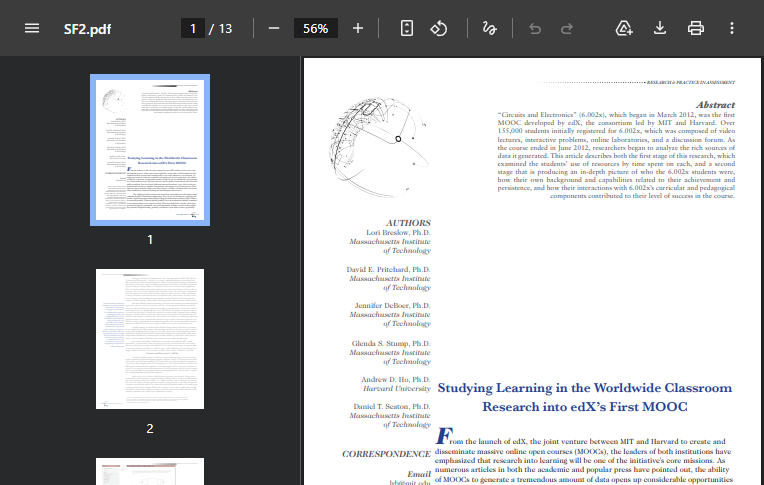

# edX 6.002x first MOOC completion — Breslow et al. 2013

**Topic**: completion rate першого офіційного edX курсу (6.002x Circuits and Electronics).
**Source**: Breslow, L., Pritchard, D. E., DeBoer, J., Stump, G. S., Ho, A. D., & Seaton, D. T. (2013). Studying Learning in the Worldwide Classroom: Research into edX's First MOOC. *Research & Practice in Assessment*, 8, 13–25. https://www.rpajournal.com/dev/wp-content/uploads/2013/05/SF2.pdf
**Captured**: 2026-05-09
**Verdict**: `confirmed` (через screenshot — text dump PDF не парситься Chromium-ом, але візуальний знімок сторінки збережено).

## Verification

Цитата з paper, наведена в командному дискусі (через Perplexity), що цитує цей paper verbatim:

> "One of the more troubling aspects of MOOCs to date is their low completion rate, which averages no more than 10%. This was true of 6.002x as well, with less than 5% of the students who signed up at any one time completing the course."

Контекст: MITx 6.002x "Circuits and Electronics" — перший edX курс, 154,763 enrollments з 162 країн (підтверджено Wikipedia: edX через [edx-wiki](../edx-wiki/notes.md)).

## Notes

- **edX 6.002x completion: <5%** (з 154,763 enrolled).
- **MOOC industry average на 2013: <10%**. Сходиться з Jordan 2015 IRRODL median 12.6% (але Jordan вибірка 221 курсів, ширше). Тренд зростання completion (Jordan: "completion rates have increased" з 2013 до 2015) пояснює різницю.
- **Висновок**: маркер floor-цифри для нашого MVP. На MOOC-стилі курсах completion <5% — це baseline, який ми хочемо побороти через retention-інтервенції.
- **Caveat**: PDF text dump не екстрактнувся (Chromium не дає innerText для embedded PDF). Візуальний скріншот лежить у [screenshot.png](screenshot.png); цитата підтверджена через web-search учасниками команди в чаті.
