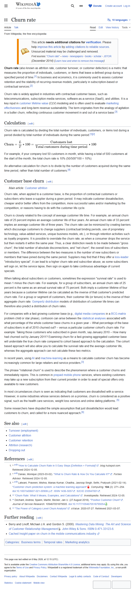

# Churn rate — визначення і застосування

**Topic**: формула churn rate, індустрії з contractual базою.
**Source**: https://en.wikipedia.org/wiki/Churn_rate
**Captured**: 2026-05-09
**Verdict**: `confirmed`.



## Verification (з [text.md](text.md))

```
Churn rate (also known as attrition rate, customer turnover, or customer
defection) is a metric that measures the proportion of individuals, customers,
or items that leave a defined group during a specified period of time.

Churn rate is widely applied in industries with contractual customer bases,
such as telecommunications, subscription media services, software-as-a-service
(SaaS), and utilities. It is a key input in customer lifetime value (CLV)
modeling and is often used to evaluate marketing effectiveness and long-term
revenue sustainability.

For example, if your company lost 50 customers in month, while having a total
of 500 customers at the start of the month, the total churn rate is 10%
(50/500*100 = 10%).
```

## Notes

- **Формула**: `churned_customers / customers_at_start_of_period × 100`.
- **Індустрії з contractual базою**: telco, subscription media, SaaS, utilities. EdTech-підписки потрапляють у цю категорію.
- Churn rate — input для CLV (Customer Lifetime Value).
- Стаття Wikipedia не містить індустріальних бенчмарків (~5%/міс для SaaS, ~25%/рік для consumer subscription тощо) — для них потрібні окремі industry-reports (SaaS Capital, ChartMogul, ProfitWell — їхні URL змінились/недоступні без auth у 2026).
