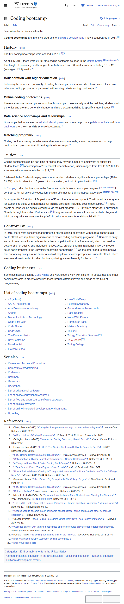

# Coding bootcamps — структура й ціни

**Topic**: тривалість, ціна, модель оплати coding-bootcamp курсів (для порівняння з MOOC і традиційною освітою).
**Source**: https://en.wikipedia.org/wiki/Coding_bootcamp
**Captured**: 2026-05-09
**Verdict**: `confirmed`.



## Verification (з [text.md](text.md))

```
As of July 2017, there were 95 full-time coding bootcamp courses in the
United States. The length of courses typically ranges from between 8 and
36 weeks, with most lasting 10 to 12 (averaging 12.9) weeks.

According to a 2017 market research report, tuition ranged from free to
$21,000 for a course, with an average tuition of $11,874.

"Deferred Tuition" refers to a payment model in which students pay the
school a percentage (18%–22.5%) of their salary for 1–3 years after
graduation, instead of upfront tuition.
```

## Notes

- **Тривалість**: 8–36 тижнів, середнє 12.9 тижнів.
- **Ціна**: $0–$21,000, середнє $11,874 (станом на 2017; цифра застаріла, але порядок зберігається).
- **Deferred tuition**: 18–22.5% зарплати протягом 1–3 років після випуску — альтернатива upfront-оплаті.
- **Ринок**: 95 full-time bootcamps у США (2017).
- **Висновок для нашого продукту**: bootcamps — окрема ніша з high-stakes payment моделлю; учні мають сильніший зовнішній стимул дочитати, ніж на MOOC. Корисно як "інший полюс retention-задачі" для порівняння.
