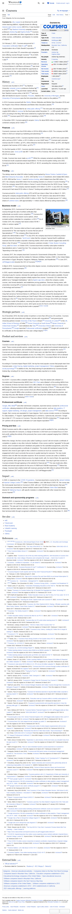

# Coursera — масштаб ринку

**Topic**: розмір аудиторії та фінансові показники найбільшого MOOC-провайдера.
**Source**: https://en.wikipedia.org/wiki/Coursera
**Captured**: 2026-05-09
**Verdict**: `confirmed`.



## Verification (з [text.md](text.md))

```
Users   168 million (2024)
Revenue US$694.7 million (2024)
Operating income  US$−114 million (2024)
Net income  US$−79 million (2024)

For the first quarter of 2021... consumer revenue was $51.9 million, up 61%,
while enterprise revenue was $24.5 million, up 63%, and degree programs had
revenue of $12 million, up 81%.

In December 2025, Coursera agreed to acquire Udemy for about $930 million in
equity, valuing the combined company at $2.5 billion.
```

## Notes

- **Користувачі**: 168 млн (2024). Найбільша MOOC-платформа.
- **Дохід**: $694.7M (2024), але **operating loss $114M** і net loss $79M — навіть на масштабі 168M юзерів платформа збиткова.
- **Структура доходу (Q1 2021)**: ~63% consumer (підписки/курси), ~30% enterprise (B2B), ~15% degree-програми.
- **Консолідація ринку**: Coursera купує Udemy ($930M, грудень 2025) → combined value $2.5B.
- **Висновок**: великий MOOC-ринок, але retention/conversion болить навіть лідеру (collisional unit economics → постійні збитки). Це підтверджує, що retention = unsolved problem на масштабі.
