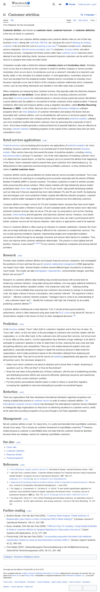

# Customer attrition modeling — оцінка та цілі

**Topic**: метрики оцінки churn-моделей у літературі.
**Source**: https://en.wikipedia.org/wiki/Customer_attrition
**Captured**: 2026-05-09
**Verdict**: `confirmed`.



## Verification (з [text.md](text.md))

```
Customer attrition modeling has a dual objective. First, it should achieve
good predictive performance, which is often measured using area under the
ROC curve or top decile lift. Second, it should deliver insights in the
drivers of churn to steer managerial decisions. [4]
```

```
Scholars have studied customer attrition at European financial services
companies, and investigated the predictors of churn and how the use of
customer relationship management (CRM) approaches can impact churn rates.
```

## Notes

- **Стандартні метрики churn-моделі**:
  - Area Under the ROC Curve (AUC).
  - Top decile lift (наскільки топ-10% по predicted score дають реальних churners).
- **Подвійна мета моделі**: predictive performance + interpretability ("drivers of churn").
- Cited reference [4]: De Caigny, Coussement, De Bock (2018), "A new hybrid classification algorithm for customer churn prediction based on logistic regression and decision trees", European Journal of Operational Research.
- **Висновок**: SHAP-feature attribution у нашій архітектурі відповідає другій частині dual objective ("deliver insights in the drivers of churn").
