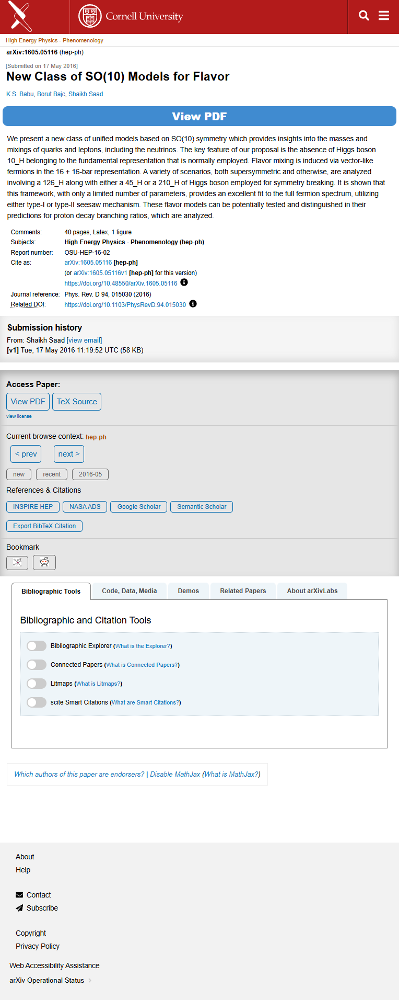

# Page text dump

Source: https://arxiv.org/abs/1605.05116



```
Skip to main content
High Energy Physics - Phenomenology
arXiv:1605.05116 (hep-ph)
[Submitted on 17 May 2016]
New Class of SO(10) Models for Flavor
K.S. Babu, Borut Bajc, Shaikh Saad
View PDF
We present a new class of unified models based on SO(10) symmetry which provides insights into the masses and mixings of quarks and leptons, including the neutrinos. The key feature of our proposal is the absence of Higgs boson 10_H belonging to the fundamental representation that is normally employed. Flavor mixing is induced via vector-like fermions in the 16 + 16-bar representation. A variety of scenarios, both supersymmetric and otherwise, are analyzed involving a 126_H along with either a 45_H or a 210_H of Higgs boson employed for symmetry breaking. It is shown that this framework, with only a limited number of parameters, provides an excellent fit to the full fermion spectrum, utilizing either type-I or type-II seesaw mechanism. These flavor models can be potentially tested and distinguished in their predictions for proton decay branching ratios, which are analyzed.
Comments:	40 pages, Latex, 1 figure
Subjects:	High Energy Physics - Phenomenology (hep-ph)
Report number:	OSU-HEP-16-02
Cite as:	arXiv:1605.05116 [hep-ph]
 	(or arXiv:1605.05116v1 [hep-ph] for this version)
 	
https://doi.org/10.48550/arXiv.1605.05116
Focus to learn more

Journal reference:	Phys. Rev. D 94, 015030 (2016)
Related DOI:	
https://doi.org/10.1103/PhysRevD.94.015030
Focus to learn more
Submission history
From: Shaikh Saad [view email]
[v1] Tue, 17 May 2016 11:19:52 UTC (58 KB)

Access Paper:
View PDFTeX Source
view license
Current browse context: hep-ph
< prev next >

new recent 2016-05
References & Citations
INSPIRE HEP

NASA ADS
Google Scholar
Semantic Scholar
Export BibTeX Citation
Bookmark
 
Bibliographic Tools
Bibliographic and Citation Tools
Bibliographic Explorer Toggle
Bibliographic Explorer (What is the Explorer?)
Connected Papers Toggle
Connected Papers (What is Connected Papers?)
Litmaps Toggle
Litmaps (What is Litmaps?)
scite.ai Toggle
scite Smart Citations (What are Smart Citations?)
Code, Data, Media
Demos
Related Papers
About arXivLabs
Which authors of this paper are endorsers? | Disable MathJax (What is MathJax?)
About
Help
Contact
Subscribe
Copyright
Privacy Policy
Web Accessibility Assistance

arXiv Operational Status 

```
