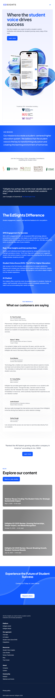

# Page text dump

Source: https://www.edsights.com/



```
Where the student voice drives success

Get the insights you need to build a student-centric institution and elevate the student journey every step of the way

Learn more
Trusted by 250+ Universities including...
OUR MISSION
Our mission is to create a student-centered higher education system. We believe that the student voice is the key to transforming education and creating the learning environment of tomorrow.
Join the Community of 250+ Universities Committed to Amplifying the Student Voice
"EdSights has perhaps the world’s most valuable data set on what college students need to navigate their academic lives."
Josh Tyrangiel, AI Columnist at The Washington Post
The EdSights Difference
Student engagement, support, and real-time feedback all in one platform
SMS Engagement for Success
With a 62% engagement rate, our AI-powered SMS technology delivers personalized communication that adapts to each student’s evolving needs. EdSights builds and manages all the communication for you. We take care of the work, so you can take care of your students.
Real-Time Insights and Intervention Data
Student and institutional level insights powered by student conversations that highlight persistence trends. The AI also flags both completed and suggested student interventions based on student responses, ensuring that the AI acts as a bridge between students and staff.
Student Voice Score (SVS): The NPS for Higher Education
Gain access to the first industry-wide benchmark for student satisfaction. Measure and compare your institution’s SVS against similar institutions, analyze how it varies across different student demographics, and unlock deeper insights into the student experience.
AI Chatbot
Our chatbot offers round-the-clock AI-powered support to students, freeing up support staff bandwidth while providing support to students whenever they need it and accommodating their varied schedules.
TESTIMONIALS
What our customers are saying
Dr. Paul Orscheln
AVP of Enrollment Management
Missouri Western State University
Phenomenal. EdSights has produced some of the most profound retention outcomes I’ve seen in my 20+ years working in Higher Ed. While data around performance and attendance is readily available, EdSights has allowed our students to be purposefully engaged in their own journey to success.
Elaine T. White
AVP for Student Affairs and Dean of Students
Vaughn College
I've worked in higher ed for more than 30 years, and this was the smoothest software implementation we've ever had. It was so easy— EdSights did most of the heavy lifting and made it so pleasurable.
Scott Barker
VP of Student Advisement
Southern New Hampshire
Technology like a chatbot can reduce the time advisors spend on hands and head work and allows them to spend more time on the heart work. This ultimately is making their work more enjoyable and leads to better student outcomes.
Dr. Cassy Bailey
Dean of Students
Baker University
EdSights has provided great insight and connection to our students with immeasurable results. Through the data, I became aware of those students who fell “between the cracks". Students were connected immediately to resources, which positively impacted their experience and our retention number
Justin Schuch
Executive Director of Retention Initiatives
Western Illinois University
We have really leveraged the interventions and risk levels (from EdSights) to be the driving force behind our entire retention strategy
Darby Gough
Dean of Students
Avila University
I am amazed at the access we now have to real-time data directly from our students
“Ranked the #6 fastest-growing education company in America” according to Inc. 5000
Learn more
BLOG
Explore our content
Read our case studies
Webinar Recap | Scaling The Student Voice for Strategic Systemwide Impact
May 5, 2026
6 min read
EdSights Q3 2025 Review: Growing Partnerships, Deeper Impact, and Media Recognition
October 15, 2025
4 min read
EdSights Q2 2025 Review: Record-Breaking Growth, Student-Centered Results
July 10, 2025
3 min read
Experience the Future of Student Success
Contact Us Today to Learn More!
Request a demo
Get the insights you need to build a student-centric institution and increase persistence
Platform
EdSights Admit
EdSights Retain
Our approach
Overview
AI Chatbot
Student Voice Score (SVS)
Integrations
Resources
Student Voice Insights
Case Studies
Partner Testimonials
Blog
Trust Center
About
Company
Careers
Community
PERSIST
Webinars and Events
Privacy policy
© All rights reserved. EdSights 2026
```
