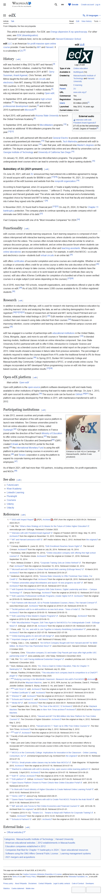

# Page text dump

Source: https://en.wikipedia.org/wiki/EdX



```
Jump to content
Main menu
Search
Appearance
Donate
Create account
Log in
Toggle the table of contents
edX
23 languages
Article
Talk
Read
Edit
View history
Tools
From Wikipedia, the free encyclopedia
This article is about education. For EDX, see Energy-dispersive X-ray spectroscopy. For other uses, see EDX (disambiguation).
"HarvardX" redirects here; not to be confused with Harvard Extension School.
edX LLC
Logo of edX

Type of site	Online education
Available in	Multilingual (14)
Created by	Massachusetts Institute of Technology and Harvard University
Industry	E-learning
Parent	2U
URL	www.edx.org
Commercial	Yes
Registration	Required
Users	83 million (2023)[1]
Launched	May 2012; 14 years ago
Current status	Active

edX LLC is an American for-profit massive open online course provider. It was founded by MIT and Harvard. It is a subsidiary of 2U.[2]

History[edit]
External audio
 Interview with edX President Anant Agarwal [17:47] on the first anniversary of edX, Degree of Freedom[3]

edX was founded in May 2012 by MIT and Harvard,[4] based on the MITx initiative, created by Piotr Mitros, Rafael Reif, and Anant Agarwal in 2011 at MIT. Gerry Sussman, Anant Agarwal, Chris Terman, and Piotr Mitros taught the first edX course on circuits and electronics from MIT, drawing 155,000 students from 162 countries. In 2013, they partnered with Stanford and in June 2013 they reached 1 million students.[5] edx.org released as open source, creating Open edX.

In September 2014, edX announced a high school initiative.[6] The following month, edX announced professional development courses,[7] and in March 2015 it partnered with Microsoft.[8]

In April 2015, edX partnered with Arizona State University to launch the Global Freshman Academy.[9]

In September 2016, edX launched 19 MicroMasters programs.[10] It launched an additional 16 MicroMasters programs the next year.[11][12]

In January 2018, edX partnered with Microsoft and General Electric to provide subsidized online courses and guaranteed job interviews.[13] That same month, Tech Mahindra partnered with edX to re-skill workforce on new tech areas.[14] Later that year, edX introduced nine Master's degrees on the platform. The degree programs can be completed fully online and are offered by universities such as Georgia Institute of Technology and University of California San Diego.[15]

On January 10, 2020, edX launched two MicroBachelors programs. The programs offer undergraduate level courses which can lead to university credit for degree seeking students.[16]

Subsidiary of 2U (2021-present)[edit]

On June 29, 2021, edX and 2U announced they had entered into a definitive agreement to merge. 2U would acquire edX's assets for $800M in cash.[17][18] On November 16, 2021, 2U completed its acquisition of the edX business and website from the nonprofit organization.[19]

According to Anant Agarwal, when 2U acquired edX, it “made a legally binding commitment to preserve and advance edX’s founding mission..." Jefferson D. Pooley, a Muhlenberg University professor and Harvard graduate said “The whole sale itself was a betrayal and a fundamentally misguided choice by Harvard and MIT to betray, in my view, the trust that faculty and students put into it when they signed onto the platform.” [20]

In November 2023, 2U found itself in financial peril.[21][22] On July 25, 2024, 2U filed for Chapter 11 bankruptcy protection. The company plans to continue operating as a private company which will eliminate over $450 million of its debt.[23]

Fast Company named edX one of its "Most Innovative Companies" for 2024.[24]

Functionality[edit]

edX courses consist of weekly learning sequences. Each learning sequence is composed of short videos interspersed with interactive learning exercises, where students can immediately practice the concepts from the videos. The courses often include tutorial videos that are similar to small on-campus discussion groups, an online textbook, and an online discussion forum where students can post and review questions and comments to each other and teaching assistants. Where applicable, online laboratories are incorporated into the course. For example, in edX's first MOOC—a circuits and electronics course—students built virtual circuits in an online lab.[25]

edX offers certificates of successful completion and some courses are credit-eligible. Whether or not a college or university offers credit for an online course is within the sole discretion of the school.[26] edX offers a variety of ways to take courses, including verified courses where students have the option to audit the course (no cost) or to work toward an edX Verified Certificate (fees vary by course). edX also offers XSeries Certificates for completion of a bundled set of two to seven verified courses in a single subject (cost varies depending on the courses).[27][28]

As of 2016, more than 150 schools, nonprofit organizations, and corporations offered or plan to offer courses on edX.[29] As of July 2020, there were 3,000 courses available for its 33 million registered students.[30]

Research[edit]

In addition to educational offerings, edX is used for research into learning and distance education by collecting learners' clicks and analyzing the data, as well as collecting demographics from each registrant.[26][31][32][33] A team of researchers at Harvard and MIT, led by David Pritchard and Lori Breslow, released their initial findings in 2013.[25] EdX member schools and organizations also conduct their own research using data collected from their courses.[34] Research focuses on improving retention, course completion and learning outcomes in traditional campus courses and online.[35]

edX has engaged in a number of partnerships with educational institutions in the United States, China, Mongolia, Japan, and more to use edX courses in "blended classrooms".[34] In blended learning models, traditional classes include an online interactive component. San Jose State University (SJSU) partnered with edX to offer 6.00xL Introduction to Computer Science and Programming, as a blended course at SJSU and released an initial report on the project in February 2013. Initial results showed a decrease in failure rates from previous semesters. The percentage of students required to retake the course dropped from 41% under the traditional format to 9% for those taking the edX blended course.[36] In Spring 2013, Bunker Hill Community College and Massachusetts Bay Community College implemented a SPOC, or small private online course. The colleges incorporated an MIT-developed Python programming course on edX into their campus-based courses, and reported positive results.[37][38]

Open edX platform[edit]
Main article: Open edX

Open edX platform is the open-source platform software developed by edX and made freely available to other institutions of higher learning that want to make similar offerings. On June 1, 2013, edX open sourced its entire platform.[39] The source code can be found on GitHub.[40][41] The platform was originally developed by Piotr Mitros in 2011, with maintenance transferred to edX in 2012.

Participating institutions[edit]
Entrance to EdX HQ in Cambridge, Massachusetts. (before it was privatized)

In late 2013, several countries and private entities announced their adoption of the edX open source platform to launch new initiatives. Ten Chinese universities joined to form an online education initiative in China, called XuetangX.[42] 120 higher education institutions in France joined under the direction of the French Ministry of Education to offer online courses throughout France,[43] the Queen Rania Foundation for Education and Development[44] (QRF) created Edraak as the first MOOC portal for the Arab world,[45] the International Monetary Fund is using the edX platform to pilot online training courses in economics and finance,[46] and Tenaris corporation is using the platform to expand its corporate training and education for its employees.[47]

As of March 2021, edX had more than 150 partners, including universities, for-profit organizations and NGOs.[48]

See also[edit]
FutureLearn
Khan Academy
LinkedIn Learning
Pluralsight
Coursera
Udemy
Udacity
References[edit]
^ "2023 edX Impact Report" (PDF). Archived (PDF) from the original on 2020-09-24. Retrieved 2023-09-21.
^ Hill, Phil. "What a New Strategy at 2U Means for the Future of Online Higher Education". www.edsurge.com. EdSurge. Retrieved 3 October 2023.
^ "Interview with edX President Anant Agarwal". Degree of Freedom (MOOC blog). May 10, 2013. Archived from the original on November 13, 2013. Retrieved May 10, 2013.
^ "MIT and Harvard announce edX". MIT media relations. May 2, 2012. Archived from the original on 2012-11-07.
^ Conway, Madeline R. (June 20, 2013). "EdX Enrollment Reaches Seven Digits". The Harvard Crimson. Archived from the original on July 26, 2014. Retrieved July 19, 2014.
^ Rocheleau, Matt (September 10, 2014). "Online education company edX offering free high school courses". The Boston Globe. Archived from the original on October 21, 2018. Retrieved September 10, 2014.
^ Korn, Melissa (October 1, 2014). "Corporate Training Gets an Online Refresh". The Washington Post. Archived from the original on December 15, 2014. Retrieved October 22, 2014.
^ "Microsoft and edX Partner to Deliver Real World Skill Learning (EdSurge News)". 10 March 2015. Archived from the original on 2015-03-18. Retrieved 2015-04-27.
^ Anderson, Nick (April 22, 2015). "Arizona State University to Offer Freshman Year Online, For Credit". The Washington Post. Archived from the original on April 28, 2015. Retrieved April 22, 2015.
^ "Thirteen universities adopt MicroMasters and launch 18 new programs via edX". MIT News. Archived from the original on 2017-03-23. Retrieved 2017-03-22.
^ "edX Expands MicroMasters Programs With Data Science, Digital Leadership and More -- Campus Technology". Campus Technology. Archived from the original on 2018-02-12. Retrieved 2017-03-22.
^ "EdX Launches Professional Certificate Programs | Inside Higher Ed". Archived from the original on 2018-05-15. Retrieved 2018-05-15.
^ "EdX Partners with Microsoft, GE to Provide Subsidized Courses | News | The Harvard Crimson". www.thecrimson.com. Archived from the original on 2018-01-28. Retrieved 2018-05-15.
^ "TechM partners edX to re-skill workforce on new tech areas - Times of India". The Times of India. Archived from the original on 2018-05-15. Retrieved 2018-05-15.
^ "EdX Launching 9 New Master's Degree Programs". Campus Technology. Archived from the original on 2019-12-26. Retrieved 2019-06-13.
^ "With 'MicroBachelors' Program, EdX Tries Again to Sell MOOCs For Undergraduate Credit - EdSurge News". EdSurge. 2020-01-08. Archived from the original on 2020-01-09. Retrieved 2020-01-09.
^ Press, edX. "2U, Inc. and edX to Join Together in Industry-Redefining Combination". press.edx.org. Archived from the original on 2021-07-09. Retrieved 2021-07-09.
^ "Online learning giants 2U and edX will merge". www.insidehighered.com. Retrieved 2021-08-25.
^ "Important changes at edX". edX. Retrieved 6 February 2022.
^ Chang, Cara J.; Cho, Isabella B. "An EdTech Company Bought edX from Harvard and MIT for $800 Million. Its Stock Price Has Plummeted Since". www.thecrimson.com. Harvard Crimson. Retrieved 2 October 2023.
^ Quintana, Chris. "Education company 2U and leader Chip Paucek part ways after high profile USC partnership ends". www.usatoday.com. USA Today. Retrieved 4 December 2023.
^ Hill, Phil. "2U / edX Facing Additional Existential Changes". onedtech.philhillaa.com. On Ed Tech. Retrieved 4 December 2023.
^ Korn, Melissa (July 25, 2024). "2U, Once a Giant in Online Education, Files for Chapter 11 Bankruptcy". The Wall Street Journal. Retrieved July 25, 2024.
^ Movan, Pavithra (19 March 2024). "This education tech company beat its competitors to a ChatGPT plugin". Fast Company. Retrieved 6 May 2025.
^ 
Jump up to:
a b Studying Learning in the Worldwide Classroom: Research Into edX's First MOOC Archived 2020-05-29 at the Wayback Machine, June 14, 2013, RPA Journal, by Lori Breslow, David E. Pritchard, Jennifer DeBoer, Glenda S. Stump, Andrew D. Ho, and Daniel T. Seaton.
^ 
Jump up to:
a b "edX FAQs". edX. Archived from the original on April 26, 2013. Retrieved August 26, 2012.
^ "Verified Certificate". edX. Archived from the original on 2014-08-07. Retrieved 2014-08-04.
^ "XSeries". edX. Archived from the original on 2015-04-21. Retrieved 2015-05-04.
^ "Schools and Partners". edX. Archived from the original on 2016-11-14. Retrieved 2014-08-04.
^ "Media Kit". edX. Archived from the original on 2020-08-01. Retrieved 2020-08-03.
^ Laura Pappano (Nov. 2, 2012), "The Year of the MOOC," Archived 2020-05-27 at the Wayback Machine The New York Times, also in New York Times archive Archived 2020-09-23 at the Wayback Machine.
^ Nick DeSantis (May 2, 2012). "Harvard and MIT Put $60-Million Into New Platform for Free Online Courses". The Chronicle of Higher Education. Archived from the original on May 4, 2012. Retrieved May 3, 2012.
^ Tamar Lewin (May 2, 2012). "Harvard and M.I.T. Team Up to Offer Free Online Courses". The New York Times. Archived from the original on May 3, 2012. Retrieved May 3, 2012.
^ 
Jump up to:
a b "edX". Archived from the original on 2013-03-28. Retrieved 2013-11-20.
^ Faculty of Arts and Sciences/Harvard College Fun (Sept/Oct 2013), "On the Leading Edge of Teaching."
^ Ellen Junn and Cathy Cheal of San Jose State University report on the universities' efforts to incorporate MIT's Electronics and Circuits course 6.002x Little Hoover Commission Public Hearing Testimony
^ "MOOCs in the Community College: Implications for Innovation in the Classroom - Online Learning Consortium, Inc". onlinelearningconsortium.org. Archived from the original on 2014-08-10. Retrieved 2014-07-19.
^ "SPOCs: Small private online classes may be better than MOOCs". Slate Magazine. 18 September 2013. Archived from the original on 2014-07-16. Retrieved 2014-07-19.
^ "Stanford to collaborate with edX to develop a free, open source online learning platform". Stanford University. 3 April 2013. Archived from the original on 2014-07-18. Retrieved 2014-06-25.
^ "EdX". GitHub. Archived from the original on 2016-11-05. Retrieved 2017-02-09.
^ "EdX-platform". GitHub. Archived from the original on 2017-04-29. Retrieved 2017-02-09.
^ "Open Source Platform Chosen to Power China's New Online Education Portal". edX. 2013-10-10. Retrieved 2014-01-01.
^ "to Work with French Ministry of Higher Education to Create National Online Learning Portal". edX. 2013-10-03. Retrieved 2014-01-01.
^ "Home | QRF". www.qrf.org. Retrieved 2023-08-01.
^ "Queen Rania Foundation Partners with edX to Create First MOOC Portal for the Arab World". edX. 2013-11-08. Retrieved 2014-01-01.
^ "IMF and edX Join Forces to Pilot Online Economics and Financial Courses". edX. 2013-06-19. Archived from the original on 2013-09-20. Retrieved 2014-01-01.
^ 4-traders (2013-11-12). "Tenaris S.A. : Tenaris to Adopt edX Platform for Corporate Training". 4-Traders. Archived from the original on 2013-12-03. Retrieved 2014-01-01.
^ "Schools & Partners". edX. 2021. Archived from the original on 2021-03-23. Retrieved 2021-03-29.
External links[edit]
Official website 
Categories: Massachusetts Institute of TechnologyHarvard UniversityAmerican educational websites2012 establishments in MassachusettsEducation companies established in 2012Companies that filed for Chapter 11 bankruptcy in 2024Open educational resourcesSoftware using the GNU Affero General Public LicenseLearning management systems2021 mergers and acquisitions
This page was last edited on 18 April 2026, at 22:49 (UTC).
Text is available under the Creative Commons Attribution-ShareAlike 4.0 License; additional terms may apply. By using this site, you agree to the Terms of Use and Privacy Policy. Wikipedia® is a registered trademark of the Wikimedia Foundation, Inc., a non-profit organization.
Privacy policy
About Wikipedia
Disclaimers
Contact Wikipedia
Legal & safety contacts
Code of Conduct
Developers
Statistics
Cookie statement
Mobile view
```
