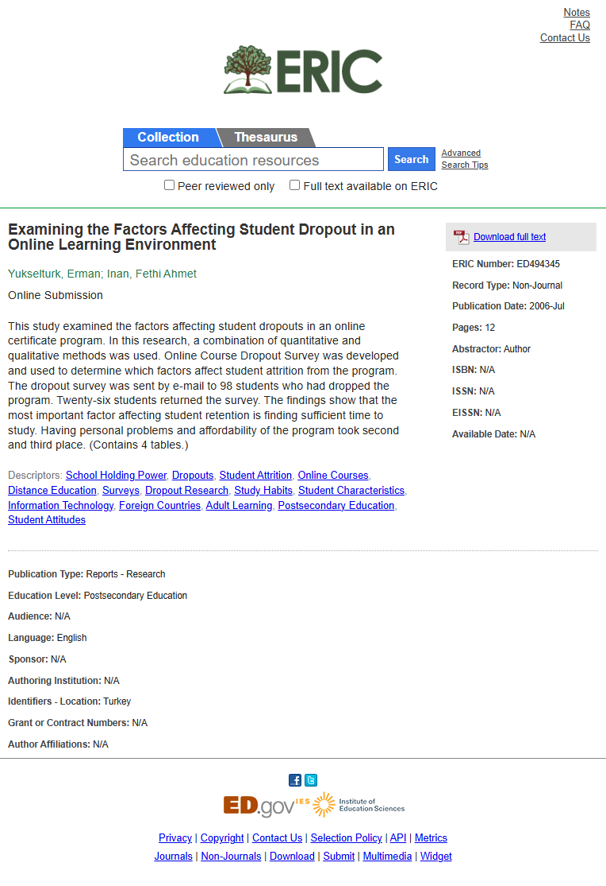

# Page text dump

Source: https://eric.ed.gov/?id=ED494345



```
Notes
FAQ
Contact Us
Collection
Thesaurus
Advanced
Search Tips
 
 Peer reviewed only  Full text available on ERIC
Download full text


ERIC Number: ED494345
Record Type: Non-Journal
Publication Date: 2006-Jul
Pages: 12
Abstractor: Author
ISBN: N/A
ISSN: N/A
EISSN: N/A
Available Date: N/A
Examining the Factors Affecting Student Dropout in an Online Learning Environment
Yukselturk, Erman; Inan, Fethi Ahmet
Online Submission
This study examined the factors affecting student dropouts in an online certificate program. In this research, a combination of quantitative and qualitative methods was used. Online Course Dropout Survey was developed and used to determine which factors affect student attrition from the program. The dropout survey was sent by e-mail to 98 students who had dropped the program. Twenty-six students returned the survey. The findings show that the most important factor affecting student retention is finding sufficient time to study. Having personal problems and affordability of the program took second and third place. (Contains 4 tables.)
Descriptors: School Holding Power, Dropouts, Student Attrition, Online Courses, Distance Education, Surveys, Dropout Research, Study Habits, Student Characteristics, Information Technology, Foreign Countries, Adult Learning, Postsecondary Education, Student Attitudes
Publication Type: Reports - Research
Education Level: Postsecondary Education
Audience: N/A
Language: English
Sponsor: N/A
Authoring Institution: N/A
Identifiers - Location: Turkey
Grant or Contract Numbers: N/A
Author Affiliations: N/A
 
Privacy | Copyright | Contact Us | Selection Policy | API | Metrics
Journals | Non-Journals | Download | Submit | Multimedia | Widget
```
