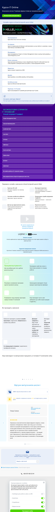

# Page text dump

Source: https://ithillel.ua/courses



```
+38 073 100 23 41
Курси IT Online

Випускаємо якісних IT-фахівців, відразу готових до працевлаштування

Безкоштовна консультація
Онлайн-курси в Комп'ютерній школі Hillel
НОВИЙ ФОРМАТ НАВЧАННЯ
Відеокурси у записі • спробуй безкоштовно!

Програмування

Курси Back-end, Front-end і DevOps

Тестування

Курси тестувальників: QA Manual та QA Automation на Java, Python та JavaScipt, а також підготовка до сертифікації ISTQB

Менеджмент

Курси менеджменту: Project та Product Management, Бізнес-аналізу, Game дизайну, а також Рекрутингу та HR

Бізнес навчання

Курси для власників бізнесу та їхніх співробітників: Power BI та Microsoft Excel, No-code розробки та використання ШІ в роботі, а також кар'єрний інтенсив.

Маркетинг

Курси інтернет-маркетингу, SMM.

Дизайн

Курси дизайну: основ Web-дизайну, UI/UX дизайну

Англійська мова

Курси англійської мови від 16 років.

Підліткові • 12-17 років

Курси програмування та дизайну для дітей від 12 до 17 років.

Не знаєте, який курс обрати?

Ми підготували матеріали та тести, які допоможуть вам у виборі вашої майбутньої професії.

Безкоштовні спринти
IT професій

Опануй популярні IT професії

Project Management Start

Project Management Start

Internet Мarketing Start

Internet Мarketing Start

JavaScript Start

JavaScript Start

Java Start

Java Start

C# Start

C# Start

SMM Start

SMM Start

Front-end Start

Front-end Start

Python Start

Python Start

QA Start

QA Start

UI/UX Start

UI/UX Start

Як знайти роботу в IT: стратегія пошуку

Як знайти роботу в IT: стратегія пошуку

(Не) шкідливі звички. Короткі вправи для твого тіла

(Не) шкідливі звички. Короткі вправи для твого тіла

Переваги онлайн-навчання в Комп'ютерній школі Hillel

Групи до 20 осіб
Викладач приділяє час кожному студенту.
Викладачі практики
У нас викладають тільки практикуючі фахівці з топових IT-компаній.
Система особистих кабінетів
Ефективне і зручне навчання.
Оперативна служба підтримки студентів
Термінові питання — своєчасне рішення.
Доступ до відеозаписів занять
Записи уроків залишаються у студентів після закінчення навчання.
Практичні заняття
Велика частина занять орієнтована на практику.
Як школа кардинально змінила парадигму працевлаштування
Оплата онлайн

Оплата здійснюється через виставлення інвойсу на e-mail через сервіси LiqPay та plata by mono.

Гарантія повернення оплати

Протягом 3 тижнів з моменту старту курсу ви можете повернути 100% внесених за навчання коштів.

Працевлаштування

Що ми робимо для того, щоб ви досягли успіху?

Проводимо майстер-класи з підготовки резюме та пошуку роботи

Регулярно оновлюємо програми курсів під вимоги ринку

Запрошуємо викладати тільки кращих практикуючих фахівців

Розвиваємо нашу мережу партнерів серед топових IT-компаній

Наші викладачі часто самі забирають до себе наших кращих Студентів ;)

Як проходить навчання

Навчання проходить в режимі онлайн-трансляції, а відеозапис зберігається в особистому кабінеті.

Домашні завдання у будь-який зручний час відправляються через особистий кабінет на перевірку викладачеві.

Викладач дає зворотній зв'язок з розбором помилок у домашньому завданні.

Ви опрацьовуєте помилки і закріплюєте пройдений матеріал.

Наші викладачі та випускники працюють в топових IT-компаніях світу

Відгуки випускників школи

2000+ відгуків випускників на сайті

1500+ відгуків з середньою оцінкою 4.93 на Google картах у наших філій

Манжос Сергій

викладач
Геннадій Богиня

Один із найкращих курсів для початку в напрямку кібербезпеки. Курс змістовний, охоплює велике коло питань кібербезпеки, формує хорошу базу для подальшого професійного розвитку.

Викладач Геннадій Богиня має значний практичний досвід і доступно пояснює матеріал, використовуючи багато прикладів, кожну тему доповнює додатковими матеріалами для більш глибокого розуміння.

Тимур Савлук

курс
Web-розробка для школярів
 
викладач
Владислав Дикий

Нереально класний вчитель! Дуже відкрита людина, з якою приємно спілкуватися. Навіть при тому, що я спочатку зовсім не розумів програмування, після курсу орієнтуюся в ньому дуже впевнено. Все пояснює доступно, завжди виділяє час на запитання. Його професіоналізм, комунікабельність і крутий підхід до уроків — це вищий клас. Однозначно 5 зірок! Якби можна було поставити більше, поставив би максимум із можливого. Рекомендую всім!

David Maiboroda

курс
Front-End Basic
 
викладач
Павло Зубак

Курс загалом цікавий, але трошки бувало нудновато. Я б трошки змінив методику навчання, щоб практична робота була прям на уроці з учнями, аби краще запам'ятовувалося. Щоб давали завдання прям на лекції і починали робити, щоб одразу була робота над помилками, а потім що залишиться —вже доробляти самостійно поза уроком.

Andrii Necheporenko

курс
3D моделювання
 
викладач
Оксана Косей

Очень понравился курс и то, как преподаватель Оксана его проводила. Вся информация была чётко структурирована. Отдельно отмечу быструю и качественную обратную связь. Рекомендую курс от данного преподавателя.

Kateryna Shylina

курс
Social Media Marketing with AI
 
викладач
Андрій Дмитренко

Я пройшла курс SMM with AI. Викладач Андрій Дмитренко просто неймовірний лектор і наставник — постійно заохочував клас до діалогу, пояснював складні теми простими й доступними словами. Він був привітний і завжди знав відповіді на всі питання які виникали під час навчального процесу. Дуже сподіваюся ,що на інших курсах такі чудові лектори як пан Андрій!

Програма курсу була послідовна й наповнена корисними інсайтами, дві лекції на тиждень ідеально вписались у мій щільний графік. Після проходження курсу маю впевненість в отриманих знаннях і точно знаю як застосувати їх у моїй роботі. Щиро дякую і сподіваюся що будуть відкриті потоки на motion design:)

Олег Лапко

курс
3D моделювання
 
викладач
Юрій Нечупорук

Найбільше сподобався підхід до викладання: матеріал подається не сухо, а через реальні кейси та практичні завдання. Окремо дякую викладачу Юрію за пояснення скланих речей простою мовою та уважність до дрібниць і постійний зв'язок. Усім рекомендую, хто хоче змінити своє життя на краще.

Olha Synytsia

курс
Таргетинг у Facebook, Instagram і TikTok with AI
 
викладач
Олена Рак

Хочу подякувати за навчання з таргету й маркетингу Олені. Вона пояснює складні речі дуже доступно та структуровано, завдяки чому навіть новачкам легко розібратися в темі. Після навчання з’явилося чітке розуміння, як будувати рекламні кампанії, працювати з аудиторіями й аналізувати результати. Дякую за підтримку, зворотний зв’язок і мотивацію рухатися далі. Це навчання стало важливим кроком у розвитку в маркетингу.

Olesia Arsonova

курс
Основи Web дизайну
 
викладач
Юля Казнєвська

Дуже дякую за навчання і підтримку)

Манжос Сергій

викладач
Геннадій Богиня

Один із найкращих курсів для початку в напрямку кібербезпеки. Курс змістовний, охоплює велике коло питань кібербезпеки, формує хорошу базу для подальшого професійного розвитку.

Викладач Геннадій Богиня має значний практичний досвід і доступно пояснює матеріал, використовуючи багато прикладів, кожну тему доповнює додатковими матеріалами для більш глибокого розуміння.

Тимур Савлук

курс
Web-розробка для школярів
 
викладач
Владислав Дикий

Нереально класний вчитель! Дуже відкрита людина, з якою приємно спілкуватися. Навіть при тому, що я спочатку зовсім не розумів програмування, після курсу орієнтуюся в ньому дуже впевнено. Все пояснює доступно, завжди виділяє час на запитання. Його професіоналізм, комунікабельність і крутий підхід до уроків — це вищий клас. Однозначно 5 зірок! Якби можна було поставити більше, поставив би максимум із можливого. Рекомендую всім!

Підпишіться на розсилку — залишайтеся у курсі трендів IT-ринку, а також новин Комп'ютерної школи Hillel

Комп'ютерна школа Online
Комп'ютерні курси

+38 073 100 23 41

ПІДТРИМКА ПЛАТЕЖІВ
227 000 підписників
Особистий кабінет
Політика конфіденційності
Згода на обробку персональних даних
Договір оферти
Антикорупційна програма
IT Wiki
Налаштувати cookies
Укр
Рус
© 2026 Комп'ютерна школа Hillel
apple
Завантажте в 
google
Завантажити з 

Налаштування cookies

Ми використовуємо файли cookie, щоб забезпечити вам найкращий досвід. Вони також дозволяють нам аналізувати поведінку користувачів, щоб постійно вдосконалювати веб-сайт для вас.
Необхідні для роботи сайту та LMS
Аналітика
Уподобання
Маркетингові
Підтвердити вибір
Дозволити усі
```
