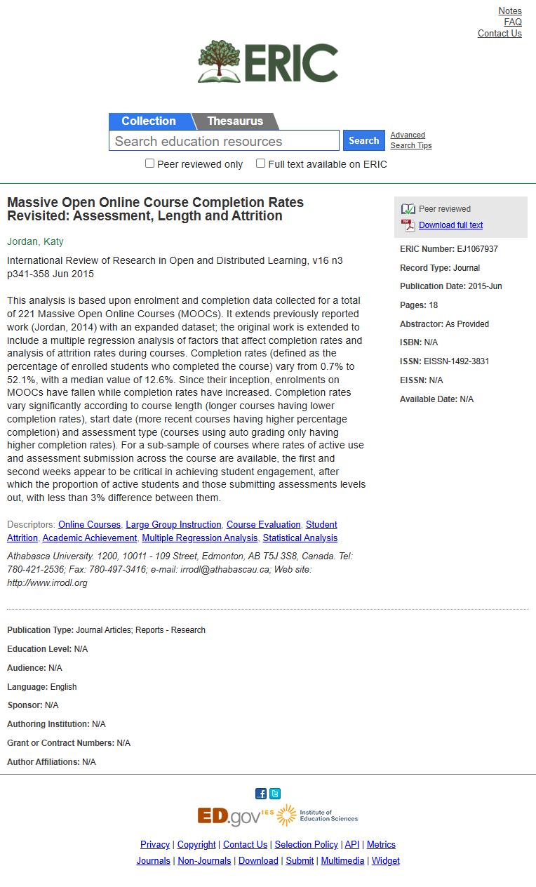

# MOOC completion rates — Jordan 2015 IRRODL (PRIMARY ACADEMIC SOURCE)

**Topic**: median MOOC completion rate, attrition patterns, critical first weeks.
**Source**: Jordan, K. (2015). Massive Open Online Course Completion Rates Revisited: Assessment, Length and Attrition. *International Review of Research in Open and Distributed Learning*, v16 n3 p341-358. ERIC EJ1067937. https://eric.ed.gov/?id=EJ1067937
**Captured**: 2026-05-09
**Verdict**: `confirmed`.



## Verification (з [text.md](text.md))

```
This analysis is based upon enrolment and completion data collected for a
total of 221 Massive Open Online Courses (MOOCs). It extends previously
reported work (Jordan, 2014) with an expanded dataset; the original work
is extended to include a multiple regression analysis of factors that
affect completion rates and analysis of attrition rates during courses.

Completion rates (defined as the percentage of enrolled students who
completed the course) vary from 0.7% to 52.1%, with a median value of 12.6%.

Since their inception, enrolments on MOOCs have fallen while completion
rates have increased.

Completion rates vary significantly according to course length (longer
courses having lower completion rates), start date (more recent courses
having higher percentage completion) and assessment type (courses using
auto grading only having higher completion rates).

For a sub-sample of courses where rates of active use and assessment
submission across the course are available, the first and second weeks
appear to be critical in achieving student engagement, after which the
proportion of active students and those submitting assessments levels out,
with less than 3% difference between them.
```

## Notes

- **Median completion rate MOOC: 12.6%** (range 0.7%–52.1%) на 221 курсі. Це primary peer-reviewed джерело — попередня цифра 15% з домашньої сторінки Katy Jordan через web archive базується на тому ж самому датасеті, але IRRODL — формальна публікація.
- **Перший і другий тижні — критичні**. Після них активність stabilизується (різниця <3%). Це **прямий emпіричний фундамент** для нашого правила "AI-моніторинг має бути найактивніший у перші 2 тижні курсу".
- **Course length effect**: довші курси мають нижчий completion rate.
- **Trend**: enrollment падає, completion зростає (станом на 2015) — індустрія дозріла, тільки замотивовані юзери реєструються.
- **Висновок для нашого продукту**:
  - Feature engineering ML-моделі має давати перші 2 тижні **в 3–5 разів більше ваги** за подальшу активність.
  - Heuristic baseline на старті може спиратися на правило "учень не активний у перші 2 тижні → high risk" — це підтримано літературою.
  - 87% baseline churn у MOOC = sweet spot для нашої product-метрики ("якщо ми знизимо churn до 75%, це 12 п.п. абсолютного покращення на величезній базі").
- Заміняє старий proof [`katy-jordan-mooc`](../katy-jordan-mooc/notes.md) як primary source; старий лишається як cross-check.
