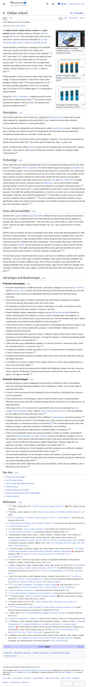

# Page text dump

Source: https://en.wikipedia.org/wiki/Cyber_school



```
Jump to content
Main menu
Search
Appearance
Donate
Create account
Log in
Toggle the table of contents
Online school
16 languages
Article
Talk
Read
Edit
View history
Tools
From Wikipedia, the free encyclopedia
(Redirected from Cyber school)
A staged example of an online classroom using Jitsi. The teacher is sharing their screen.
Number of Students Taking Distance Courses by Level (2012–2015)[1]
Percentage of Students Taking Distance Courses (2012–2015)[1]

An online school (virtual school, e-school, or cyber-school) teaches students entirely or primarily online or through the Internet. Online education exists all around the world and is used for all levels of education (K-12 High school/secondary school, college, or graduate school).

Virtual education is becoming increasingly used worldwide. There are currently more than 4,700 colleges and universities that provide online courses to their students.[2] In 2015, more than 6 U.S. million students were taking at least one course online; this number grew by 3.9% from the previous year.[1] In 2021, more than 53% of postgraduate students were taking at least some classes online. The total number of online students in the U.S. was 7.5 million in 2024.[3]

Virtual education is most commonly used in high school and college. 30-year-old students or older tend to study online programs at higher rates.[4] This group represents 41% of the online education population, while 35.5% of students ages 24–29 and 24.5% of students ages 15–23 participate in virtual education.

During the COVID-19 pandemic, students around the world were forced to attend school online.[5] The number of online students decreased in 2022 and 2023, but remained well above pre-pandemic levels.[3]

Description[edit]

Instructional models for online schools vary, ranging from distance learning types which provide study materials for independent self-paced study, to live, interactive classes where students communicate with a teacher in a class group lesson.

The courses that are independent and self-paced are called asynchronous courses. Typically for this type of learning, the students are given the assignments and information and are expected to complete the assignments by a due date, on their own time.

On the other hand, synchronous online courses happen in real-time. The instructor and students all interact online at the same time. This is done either through text, video, or audio chat.

Hybrid, sometimes also called blended, courses are when students learn and interact both in-person and online. These classes meet in-person during the semester in addition to computer-based communication.[6]

Technology[edit]

Virtual classrooms are made possible through the use of educational technology with the help of the internet.[7] During the COVID-19 pandemic, the United States began to encourage social distancing in the education system. One use of technology that was found to be resourceful in the collaboration of students and teachers in virtual learning was the use of video conferencing. The utilization of web video conferencing allows students to communicate virtually with their teachers and simulate a classroom environment, with many using services such as Zoom and Cisco WebEx.[8] To engage virtual students even further, a process known as gamification can be used to teach a student learning material in a form of a game to bring more enjoyment in a student's learning experience.[9] Secondlife, an online virtual world, is a type of gamification system that is used for online educational purposes. Secondlife has qualities that resembles an in person curriculum such as class discussions, participation in lectures, and completing assignments.[10] Gamification can also serve as an aide to increase a student's intrinsic motivation.[11] The use of rewarding points while a student is using a gamification system can enhance internal motivation and motivate the student to accomplish learning goals from the game's objective.[12]

Costs and accessibility[edit]

Students with cognitive and/or physical disabilities oftentimes face issues accessing online schools. One of the groups of disabled students who have difficulty accessing online learning platforms is students with severe visual impairments. They most often use screen readers in order to use online school, but there are many instances where activities, files, etc., don't support the use of screen readers.[13]

Another group of students who face accessibility issues when using online learning platforms is deaf and hard of hearing students. The most prevalent issue that this group of students face is lack of or inaccurate captioning on video and audio media. Another group that has issues accessing online schooling resources is students with motor impairments. These students often have a difficult time using a computer or tablet, and will sometimes use another technology in order to interact with the computer or tablet. This makes learning especially difficult when game-like activities are used for learning and when timed activities or real-time instruction is taking place.[13]

The last major group of students who face access issues due to a disability is students with cognitive disabilities. There are a wide range of cognitive disabilities which means that these disabilities can impact learning in a variety of different ways. Some of the accessibility issues that students with cognitive disabilities face include: busy/disorganized media, pages that are difficult to navigate, time constraints, flashing of the screen, pages or articles that lack proper titles and headings, and much more.[13]

Advantages and disadvantages[edit]
Potential advantages[edit]
Personal circumstances or health disruptions, specifically contagious viruses such as COVID-19 and the common cold, or injuries will not halt learning since the physical demands are much less.
Digital transcripts of lessons can additionally help absent students with learning missed curriculum.
Online learning is ideal for students and families who need flexible arrangements. However, synchronous learning does impose limits due to time zones.
The integration of Internet resources provides a huge library of content, and students quickly become proficient with online research, resources, and tools.
Greater flexibility enables independent students such as self-learners or gifted students to explore learning beyond the standard curriculum, pursue individual skills and ambitions, or develop at their own preferred pace using online resources. Part-time students with jobs or family commitments may benefit from the flexibility of online schedules.[14]
Online schools can be equalizers, as age, appearance, and background are far less obvious, and therefore this can minimize harassment, prejudice, or discrimination. Instead, groups are categorized by personal ability.
Students may benefit from exposure to others in different cultures of the world in online schools, providing an array of different perspectives. Through this exposure, students may develop greater cultural awareness and competency.[15]
Online education may collaboratively engage in or discuss universal or real-world issues, which are necessary skills for a successful career.[16]
Increased accessibility to remote education for poor or rural areas where commuting to schools or lack of resources are concerns.[16]
Increased opportunities may allow a student to take more courses they are interested in that are not offered near them.
Cost-effective for schools or districts since it allows teachers to instruct more students than in a face-to-face classroom setting.[17]
Online courses may be less expensive for students than traditional classes since less resources may be required. Additionally, many learning resources online are free, easy to access, self-paced, and beginner-friendly.[18]
Potential disadvantages[edit]
Remote learning can reduce engagement and interaction and lead to a lack of socialization, which can potentially decrease a student's social competence or skills, such as their ability to cooperate with others.
A home or online environment may potentially be more distracting or disrupting than a physical school environment.
Those without access to technology or devices would not have access to virtual education. Although some schools may offer students borrowed devices, those who do not have access can easily fall behind.
Technology or the Internet can be more unpredictable since it may be vulnerable to power outages, Internet outages, hacks, exploits, online trolling, glitches, or errors that can potentially be more difficult to fix or deal with when online.[18]
Potential employers may be skeptical of the credibility of online degrees and virtual programs.[18]
Cheating online may be easier or more tempting since online resources may be more accessible and restrictions or consequences may be more lenient.[18] The increased anonymity online may further encourage or allow the continuance of misbehavior such as trolling.
Not using the physical tools might diminish a student's ability or competence.[19]
Online can be potentially limiting since physical activities or hands on activities, specifically for courses like physical education, Art, and Chemistry, may be more difficult to engage in or occur less frequent. Online classes might take away the value of the active elements that some courses require, and do not offer the same teacher-student relationships. Students might also not experience the same critical thinking, observation, and creative skills.[20]
Because online learning has 24-hour flexibility, work-life boundaries can be difficult to establish, which can cause mental and emotional health issues to arise.[21]
The immediate availability of AI technologies to assist with students' coursework leads to less interactions with course staff. This also leads to the student not properly learning the material and not properly developing study skills.[21]
For students with certain intellectual and/or physical disabilities, online learning platforms can be difficult to access and use.[22]
See also[edit]
Educational technology
List of virtual schools
List of online educational resources
Virtual campus
Virtual learning environment
Virtual school libraries in the United States
Online university
References[edit]
^ 
Jump up to:
a b c Allen, Elaine (May 2017). "Distance Education Enrollment Report 2017" (PDF). Digital Learning Compass.
^ Friedman, Jordan (January 11, 2018). "Studey: More Students are Enrolling in Online Courses". U.S News.
^ 
Jump up to:
a b "By The Numbers: The Rise Of Online Learning In The U.S. – Forbes Advisor". www.forbes.com. Retrieved 2024-04-19.
^ "Demographics of an Online Learner | Walden University". www.waldenu.edu. Retrieved 2024-04-19.
^ "World Economic Forum".
^ D., Potts Zachary. "Types of Online Learning". www.fordham.edu. Retrieved 2018-10-25.
^ "Distance learning | education". Encyclopedia Britannica. Retrieved 2020-11-17.
^ Mukhopadhyay, Sanjay; Booth, Adam L.; Calkins, Sarah M.; Doxtader, Erika E.; Fine, Samson W.; Gardner, Jerad M.; Gonzalez, Raul S.; Mirza, Kamran M.; Jiang, Xiaoyin (Sara) (2020-05-04). "Leveraging Technology for Remote Learning in the Era of COVID-19 and Social Distancing". Archives of Pathology & Laboratory Medicine. 144 (9): 1027–1036. doi:10.5858/arpa.2020-0201-ed. ISSN 1543-2165. PMID 32364793.
^ Doumanis, Ioannis; Economou, Daphne; Sim, Gavin Robert; Porter, Stuart (2019-03-01). "The impact of multimodal collaborative virtual environments on learning: A gamified online debate". Computers & Education. 130: 121–138. doi:10.1016/j.compedu.2018.09.017. ISSN 0360-1315. S2CID 59336901.
^ FLINK, P. (2019). Second Life and Virtual Learning: An Educational Alternative for Neurodiverse Students in College. College Student Journal, 53(1), 33–41
^ Saputro, Rujianto Eko; Salam, Sazilah; Zakaria, Mohd. Hafiz; Anwar, Toni (2019-02-01). "A gamification framework to enhance students' intrinsic motivation on MOOC". TELKOMNIKA (Telecommunication Computing Electronics and Control). 17 (1): 170. doi:10.12928/telkomnika.v17i1.10090. ISSN 2302-9293.
^ Gafni, Ruti; Biran Achituv, Dafni; Eidelman, Shimon; Chatsky, Tomer (2018-05-13). "The effects of gamification elements in e-learning platforms". Online Journal of Applied Knowledge Management. 6 (2): 37–53. doi:10.36965/OJAKM.2018.6(2)37-53. ISSN 2325-4688.
^ 
Jump up to:
a b c "Four Types of Disabilities: Their Impact on Online Learning". TechTrends. 52 (1): 51–55. January 2008. doi:10.1007/s11528-008-0112-6. ISSN 8756-3894. S2CID 140955393.
^ "Distance learning | education". Encyclopedia Britannica. Retrieved 2020-11-23.
^ "How Online Education Is Shaping the Future Workforce". online.umn.edu. Retrieved 2025-06-10.
^ 
Jump up to:
a b Harsasi, Meirani. "A Study of a Distance Education Institution" (PDF). Determinants of Student Satisfaction in Online Tutorial. 19: 89–99 – via Eric.
^ Dynarski, Susan M. (2017-10-26). "Online schooling: Who is harmed and who is helped?". Brookings. Retrieved 2018-10-29.
^ 
Jump up to:
a b c d "Pros and Cons of Online Education | NC State Industry Expansion Solutions". NC State Industry Expansion Solutions. 19 August 2015. Retrieved 2018-10-29.
^ Calkins, Ruth. "How to Keep Kindergartners Engaged in Distance Learning". Edutopia. Retrieved 2020-12-14.
^ "Hands on Art Approach to Learning". Hands On Art 4 Everyone. 2019-02-19. Retrieved 2022-03-06.
^ 
Jump up to:
a b Robinson, Elaine; McQuaid, Ronald; Webb, Aleksandra; Webster, C. William R. (2021), "Unintended Consequences of E-Learning: Reflections on the Digital Transformation of Learning in Higher Education", Transformations of Regional and Local Labour Markets Across Europe in Pandemic and Post-Pandemic Times, Rainer Hampp Verlag, pp. 379–398, doi:10.5771/9783957104007-379, ISBN 978-3-95710-400-7, S2CID 239143286, retrieved 2023-12-08
^ Goldhaber, Dan; Kane, Thomas; McEachin, Andrew; Morton, Emily; Patterson, Tyler; Staiger, Douglas (May 2022). The Consequences of Remote and Hybrid Instruction During the Pandemic (Report). Cambridge, MA: National Bureau of Economic Research. doi:10.3386/w30010.
show
vte
School types


Categories: Alternative educationDistance educationEducational technologyInternet culture
This page was last edited on 30 March 2026, at 20:12 (UTC).
Text is available under the Creative Commons Attribution-ShareAlike 4.0 License; additional terms may apply. By using this site, you agree to the Terms of Use and Privacy Policy. Wikipedia® is a registered trademark of the Wikimedia Foundation, Inc., a non-profit organization.
Privacy policy
About Wikipedia
Disclaimers
Contact Wikipedia
Legal & safety contacts
Code of Conduct
Developers
Statistics
Cookie statement
Mobile view
```
