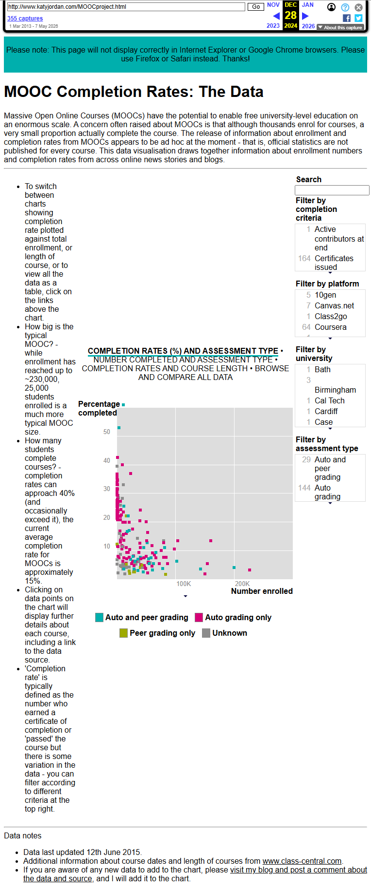

# MOOC completion rates — Katy Jordan dataset

**Topic**: середній completion rate MOOC.
**Source**: https://web.archive.org/web/2024/https://www.katyjordan.com/MOOCproject.html (архів дослідницького сайту Katy Jordan, Open University UK)
**Captured**: 2026-05-09
**Verdict**: `confirmed`.



## Verification (з [text.md](text.md))

```
How big is the typical MOOC? - while enrollment has reached up to ~230,000,
25,000 students enrolled is a much more typical MOOC size.

How many students complete courses? - completion rates can approach 40%
(and occasionally exceed it), the current average completion rate for MOOCs
is approximately 15%.

'Completion rate' is typically defined as the number who earned a certificate
of completion or 'passed' the course
```

## Notes

- **Середній completion rate MOOC: 15%**.
- **Максимум: ~40%** (рідкісні випадки).
- **Типовий розмір MOOC**: 25,000 enrollments; максимум — ~230,000.
- Definition: certificate-of-completion або "passed" статус.
- Katy Jordan (Open University) — дослідниця освітніх технологій, дата підбита з понад 200 MOOC у її датасеті.
