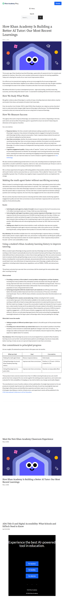

# Page text dump

Source: https://blog.khanacademy.org/how-khan-academy-is-building-a-better-ai-tutor-our-most-recent-learnings/



```
Skip to content
Donate

How Khan Academy Is Building a Better AI Tutor: Our Most Recent Learnings 
MAY 1, 2026

Three years ago, Khan Academy launched Khanmigo, a generative AI-powered tutor for students and assistant for teachers. Since then, we’ve worked continuously to improve its tutoring capabilities. Today we’re sharing the results of our most recent improvement efforts. 

Our efforts are incremental and ongoing, and we are encouraged by the six-percentage-point improvement described below. Applied across millions of practice sessions per day, the gain translates to a meaningful increase in the number of students who learn from each tutoring interaction.

We believe this kind of  product-development process—rigorously testing, carefully measuring outcomes, and discarding what doesn’t work—is essential for building effective AI tools in education.

How We Study What Works

We gather evidence about Khanmigo in a variety of ways, including classroom observations, teacher and student interviews, and analysis of student chat transcripts. 

Over six months, from October 2025 to April 2026, Khan Academy ran a rigorous series of product tests to understand what changes might improve Khanmigo’s effectiveness. The following findings summarize what we’ve learned and how we are using them to improve Khanmigo.

How We Measure Success

Throughout this work to improve Khanmigo, we tracked three core metrics. Depending on the test, each metric served as either the primary goal or a guardrail to ensure we weren’t improving one dimension at the expense of another.

Our core metrics:

Response latency: the time a student waits between asking a question and receiving Khanmigo’s response. A key element of keeping students engaged is having the interaction with Khanmigo feel like a natural conversation. Faster responses keep students focused and are critical to making the tool feel natural.
Next-item correctness: whether the student answers the next problem correctly after receiving tutoring. Next-item correctness measures whether the student correctly answered the very next problem on the same skill during the same session without any help from Khanmigo. It is a direct measure of independent learning transfer, not just of performance with AI assistance.
Cognitive engagement quality: Using a scale of “passive,” “active,” and “constructive” ratings, an automated assessment of whether the exchange in each tutoring interaction was at least active, meaning the student was reasoning and engaging instead of just passively receiving information. You can read more about our work to measure cognitive engagement in ACL Anthology.

We also monitored additional guardrail metrics in every test, including instances of giving the answer away before a student submitted a response, math error rates, and interactions per thread, in order to ensure that changes were not causing unintended harm elsewhere.

We run these experiments through an A/B testing platform that predicts whether the tested version will result in better metrics outcomes than our control version. This is called its “chance to win.”  If that probability is greater than .95 without any negative impact on guardrail metrics, we implement the change. 

Making the math agent faster without sacrificing accuracy

When a student is working through a math problem, Khanmigo has a specialized system that verifies calculations and checks mathematical expressions in real time. This “math agent” runs behind the scenes and helps ensure that when Khanmigo responds to a student, the math is correct. Reducing the time this system takes to respond is key. The less wait time a student experiences between asking a question and receiving a response, the more they stay engaged and the more natural the tool feels. 

We ran a series of product tests focused on reducing wait time while closely monitoring cognitive-engagement quality and next-item correctness to ensure that faster responses did not come at the expense of educational quality.

Results:

Switching the math agent to a faster AI model reduced response time by 0.3 seconds across 1.35 million tutoring threads over 12 days. Math accuracy held steady.
Instructing the math agent to produce a more concise response to Khanmigo reduced mean response time by three seconds across 352,000 tutoring threads over five days. A follow-up experiment in which we limited the agent to focusing on the math the student had already done instead of also working out the remaining steps to get to the solution reduced latency by another 400 milliseconds and reduced giving away the answer by 50%. Math accuracy held steady.
Adding a pre-check that determined whether a math-verification step was even needed before invoking the math agent reduced unnecessary calls to the system across 1.04 million tutoring threads, cutting response time by about 0.3 seconds. Math accuracy held steady.

Key takeaway: We identified multiple levers for reducing Khanmigo’s response latency, including a faster model, shorter outputs, tighter time-outs, and smarter routing without sacrificing the quality of the tutoring. These improvements matter for student experience—faster responses keep students focused—and for cost sustainability at scale.

Using a student’s Khan Academy learning history to improve tutoring

When a student opens Khanmigo during a practice exercise, Khanmigo sees the problem they’re working on. But it doesn’t automatically know how the student has been performing on that exercise, what skill level they’ve demonstrated, or where they’ve been getting stuck. We ran a series of product tests to evaluate whether giving Khanmigo access to more of a student’s Khan Academy learning history, including their recent practice attempts, demonstrated skill levels, and prerequisite progress, would help it tutor more effectively. An important privacy note: Khanmigo complies with privacy regulations, including student data privacy regulations, such as FERPA, COPPA, and state privacy laws. 

The primary outcome here was next-item correctness: did the student get the next problem right after receiving tutoring?

What worked:

Providing a summary of the student’s recent problem-solving history on Khan Academy, including how many problems they attempted recently and which ones they got right and wrong, improved next-item correctness by +3.4% across 608,000 tutoring threads. There is a 97.5% chance including this information will be better than not including it in the overall population of users. All guardrail metrics held.
Surfacing prerequisite skills the student hasn’t yet mastered and offering a brief review before the harder problem improved next-item correctness by 2.7% across 1.36 million tutoring threads. There is a 98.5% chance of better outcomes than when this information is not included. 
Providing the full in-session conversation log. Initially, including the full in-session conversation log as part of the information available to the model as students continued working on skills did not lead to measurable improvements in student performance on its own. We then made two changes: 1) we put the conversation in plain text instead of in hard-to-parse json, a data transfer format and 2) we added all the threads related to this skill for the previous 24 hours instead of just in the current session. When doing this, we found a 5.09% increase in cognitive engagement—a 99.4% chance of better engagement with this information than without it. We are currently planning experiments that involve extracting the pedagogically meaningful elements of the logs to pass to Khanmigo rather than just passing the raw logs.

What didn’t move the needle:

Adding examples of different problem types related to the skill as part of the prompt showed no effect.
Providing more relevant follow-up content links based on the student’s position in the Khan Academy content showed no statistically significant change in next-item correctness. The change was rolled out because it did no harm and modestly reduced response time, making the experience slightly faster for students.

Key takeaway: When Khanmigo has access to structured signals from a student’s Khan Academy learning record, such as their recent performance patterns and skill gaps, it produces measurably better tutoring. In total, we see a 6.1 percent improvement in next-item correctness.

Our commitment to principled progress

Across roughly 20 substantive product tests in this space over six months:

What we tried	Goal	Core metrics
Making the math agent faster	Reduce response latency	Held steady
Giving Khanmigo structured Khan Academy learning history	Improve next-item correctness	Positive (+2.7% and +3.4% for a total of 6.1%)
Giving Khanmigo hard-to-parse data	Improve next-item correctness	Neutral, no measurable effect

These product tests covered a total of more than 15 million tutoring threads across a six-month period. Each test compared the new version against the existing product experience, and results were evaluated for their probability of changing our key metrics before any change was broadly shipped.

The overall picture is one of careful, evidence-driven optimization. No single improvement on its own produced a dramatic leap forward, but collectively, this body of work has meaningfully improved Khanmigo’s effectiveness and identified less expensive and faster ways to run it at scale.
A full paper describing our metrics, infrastructure, and experiment results will be published in the 27th International Conference in AI for Education.

Meet the New Khan Academy Classroom Experience

May 5, 2026

How Khan Academy Is Building a Better AI Tutor: Our Most Recent Learnings 

May 1, 2026

ADA Title II and Digital Accessibility: What Schools and EdTech Need to Know

April 28, 2026

Menu
Search
Search for:

Experience the best AI-powered
tool in education.

For teachers
For families
For districts

Visit Khan Academy

© 2026 Khan Academy
```
