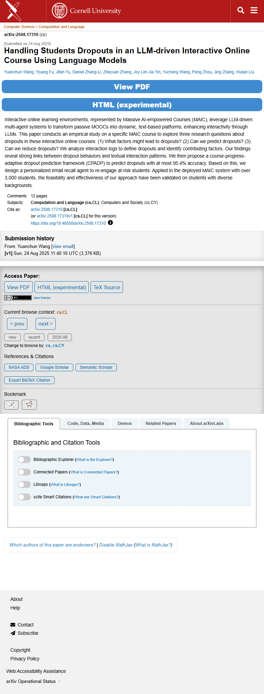

# Page text dump

Source: https://arxiv.org/abs/2508.17310



```
Skip to main content
Computer Science > Computation and Language
arXiv:2508.17310 (cs)
[Submitted on 24 Aug 2025]
Handling Students Dropouts in an LLM-driven Interactive Online Course Using Language Models
Yuanchun Wang, Yiyang Fu, Jifan Yu, Daniel Zhang-Li, Zheyuan Zhang, Joy Lim Jia Yin, Yucheng Wang, Peng Zhou, Jing Zhang, Huiqin Liu
View PDF
HTML (experimental)
Interactive online learning environments, represented by Massive AI-empowered Courses (MAIC), leverage LLM-driven multi-agent systems to transform passive MOOCs into dynamic, text-based platforms, enhancing interactivity through LLMs. This paper conducts an empirical study on a specific MAIC course to explore three research questions about dropouts in these interactive online courses: (1) What factors might lead to dropouts? (2) Can we predict dropouts? (3) Can we reduce dropouts? We analyze interaction logs to define dropouts and identify contributing factors. Our findings reveal strong links between dropout behaviors and textual interaction patterns. We then propose a course-progress-adaptive dropout prediction framework (CPADP) to predict dropouts with at most 95.4% accuracy. Based on this, we design a personalized email recall agent to re-engage at-risk students. Applied in the deployed MAIC system with over 3,000 students, the feasibility and effectiveness of our approach have been validated on students with diverse backgrounds.
Comments:	12 pages
Subjects:	Computation and Language (cs.CL); Computers and Society (cs.CY)
Cite as:	arXiv:2508.17310 [cs.CL]
 	(or arXiv:2508.17310v1 [cs.CL] for this version)
 	
https://doi.org/10.48550/arXiv.2508.17310
Focus to learn more
Submission history
From: Yuanchun Wang [view email]
[v1] Sun, 24 Aug 2025 11:40:16 UTC (3,376 KB)

Access Paper:
View PDFHTML (experimental)TeX Source
view license
Current browse context: cs.CL
< prev next >

new recent 2025-08
Change to browse by: cs cs.CY
References & Citations
NASA ADS
Google Scholar
Semantic Scholar
Export BibTeX Citation
Bookmark
 
Bibliographic Tools
Bibliographic and Citation Tools
Bibliographic Explorer Toggle
Bibliographic Explorer (What is the Explorer?)
Connected Papers Toggle
Connected Papers (What is Connected Papers?)
Litmaps Toggle
Litmaps (What is Litmaps?)
scite.ai Toggle
scite Smart Citations (What are Smart Citations?)
Code, Data, Media
Demos
Related Papers
About arXivLabs
Which authors of this paper are endorsers? | Disable MathJax (What is MathJax?)
About
Help
Contact
Subscribe
Copyright
Privacy Policy
Web Accessibility Assistance

arXiv Operational Status 

```
