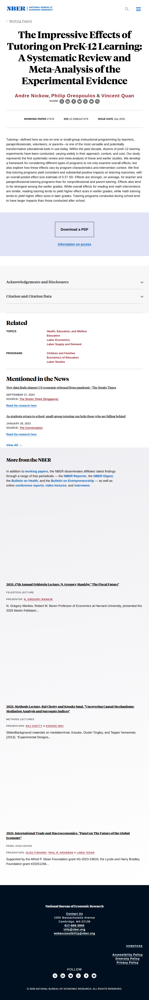

# Page text dump

Source: https://www.nber.org/papers/w27476



```
Skip to main content
Working Papers
The Impressive Effects of Tutoring on PreK-12 Learning: A Systematic Review and Meta-Analysis of the Experimental Evidence
Andre Nickow, Philip Oreopoulos & Vincent Quan
SHARE
X
LinkedIn
Facebook
Bluesky
Threads
Email
Link
WORKING PAPER 27476
DOI 10.3386/w27476
ISSUE DATE July 2020

Tutoring—defined here as one-on-one or small-group instructional programming by teachers, paraprofessionals, volunteers, or parents—is one of the most versatile and potentially transformative educational tools in use today. Within the past decade, dozens of preK-12 tutoring experiments have been conducted, varying widely in their approach, context, and cost. Our study represents the first systematic review and meta-analysis of these and earlier studies. We develop a framework for considering different types of programs to not only examine overall effects, but also explore how these effects vary by program characteristics and intervention context. We find that tutoring programs yield consistent and substantial positive impacts on learning outcomes, with an overall pooled effect size estimate of 0.37 SD. Effects are stronger, on average, for teacher and paraprofessional tutoring programs than for nonprofessional and parent tutoring. Effects also tend to be strongest among the earlier grades. While overall effects for reading and math interventions are similar, reading tutoring tends to yield higher effect sizes in earlier grades, while math tutoring tends to yield higher effect sizes in later grades. Tutoring programs conducted during school tend to have larger impacts than those conducted after school.

Download a PDF
Information on access
Acknowledgements and Disclosures
Citation and Citation Data
Related
TOPICS
Health, Education, and Welfare
Education
Labor Economics
Labor Supply and Demand
PROGRAMS
Children and Families
Economics of Education
Labor Studies
Mentioned in the News
New data finds sharper US economic rebound from pandemic | The Straits Times
SEPTEMBER 27, 2024
SOURCE: The Straits Times (Singapore)
Read the research here.
As students return to school, small-group tutoring can help those who are falling behind
JANUARY 29, 2023
SOURCE: The Conversation
Read the research here.
View All
More from the NBER

In addition to working papers, the NBER disseminates affiliates’ latest findings through a range of free periodicals — the NBER Reporter, the NBER Digest, the Bulletin on Health, and the Bulletin on Entrepreneurship — as well as online conference reports, video lectures, and interviews.

2025, 17th Annual Feldstein Lecture, N. Gregory Mankiw," The Fiscal Future"
FELDSTEIN LECTURE
PRESENTER: N. GREGORY MANKIW
N. Gregory Mankiw, Robert M. Beren Professor of Economics at Harvard University, presented the 2025 Martin Feldstein...
2025, Methods Lecture, Raj Chetty and Kosuke Imai, "Uncovering Causal Mechanisms: Mediation Analysis and Surrogate Indices"
METHODS LECTURES
PRESENTERS: RAJ CHETTY & KOSUKE IMAI
SlidesBackground materials on mediationImai, Kosuke, Dustin Tingley, and Teppei Yamamoto. (2013). “Experimental Designs...
2025, International Trade and Macroeconomics, "Panel on The Future of the Global Economy"
PANEL DISCUSSION
PRESENTERS: OLEG ITSKHOKI, PAUL R. KRUGMAN & LINDA TESAR
Supported by the Alfred P. Sloan Foundation grant #G-2023-19633, the Lynde and Harry Bradley Foundation grant #20251294...
National Bureau of Economic Research

Contact Us
1050 Massachusetts Avenue
Cambridge, MA 02138
617-868-3900
info@nber.org
webaccessibility@nber.org

HOMEPAGE
Accessibility Policy
Diversity Policy
Privacy Policy
FOLLOW
© 2026 NATIONAL BUREAU OF ECONOMIC RESEARCH. ALL RIGHTS RESERVED.
```
