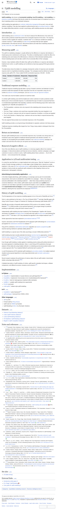

# Page text dump

Source: https://en.wikipedia.org/wiki/Uplift_modelling



```
Jump to content
Main menu
Search
Appearance
Donate
Create account
Log in
Toggle the table of contents
Uplift modelling
4 languages
Article
Talk
Read
Edit
View history
Tools
From Wikipedia, the free encyclopedia

Uplift modelling, also known as incremental modelling, true lift modelling, or net modelling, is a predictive modelling technique that directly models the incremental impact of a treatment (such as a direct marketing action) on an individual's behaviour.

Uplift modelling has applications in customer relationship management for up-sell, cross-sell and retention modelling. It has also been applied to political election and personalised medicine. Unlike the related differential prediction concept in psychology, uplift modelling assumes an active agent.

Introduction[edit]

Uplift modelling uses a randomized control not only to measure the effectiveness of an action but also to build a predictive model that predicts the incremental response to the action. The response could be a binary variable (for example, a website visit)[1] or a continuous variable (for example, customer revenue).[2] Uplift modelling is a data mining technique that has been applied predominantly in the financial services, telecommunications and retail direct marketing industries to up-sell, cross-sell, churn, and retention activities.

Measuring uplift[edit]

The uplift of a marketing campaign is usually defined as the difference in response rate between a treated group and a randomized control group. This allows a marketing team to isolate the effect of a marketing action and measure the effectiveness or otherwise of that individual marketing action. Honest marketing teams will only take credit for the incremental effect of their campaign.

However, many marketers define lift (rather than uplift) as the difference in response rate between treatment and control, so uplift modeling can be defined as improving (upping) lift through predictive modeling.

The table below shows the details of a campaign showing the number of responses and calculated response rate for a hypothetical marketing campaign. This campaign would be defined as having a response rate uplift of 5%. It has created 50,000 incremental responses (100,000 − 50,000).

Group	Number of Customers	Responses	Response Rate
Treated	1,000,000	100,000	10%
Control	1,000,000	50,000	5%
Traditional response modelling[edit]

Traditional response modelling typically takes a group of treated customers and attempts to build a predictive model that separates the likely responders from the non-responders using one of a number of predictive modelling techniques, such as decision trees or regression analysis.

This model uses only the treated customers to build the model.

In contrast uplift modeling uses both the treated and control customers to build a predictive model that focuses on the incremental response. To understand this type of model it is proposed that there is a fundamental segmentation that separates customers into the following groups (their names were suggested by N. Radcliffe and explained in [3]):

The Persuadables: customers who only respond to the marketing action because they were targeted
The Sure Things: customers who would have responded whether they were targeted or not
The Lost Causes: customers who will not respond irrespective of whether or not they are targeted
The Do Not Disturbs or Sleeping Dogs: customers who are less likely to respond because they were targeted

The only segment that provides true incremental responses is the Persuadables.

Uplift modelling provides a scoring technique that attempts to separate customers into these groups.

Traditional response modelling often targets the Sure Things, being unable to distinguish them from the Persuadables.

Return on investment[edit]

Because uplift modelling focuses on incremental responses only, it provides very strong return-on-investment cases when applied to traditional demand generation and retention activities. For example, by only targeting the persuadable customers in an outbound marketing campaign, the contact costs and hence the return per unit spend can be dramatically improved.

Removal of negative effects[edit]

One of the most effective uses of uplift modelling is in removing negative effects from retention campaigns. In telecommunications and financial services industries, retention campaigns can trigger customers to cancel a contract or policy. Uplift modelling allows these customers — the Do Not Disturbs — to be removed from the campaign.

Application to A/B and multivariate testing[edit]

It is rarely the case that there is a single treatment and control group. Often the "treatment" can be a variety of simple message variations or a multi-stage contact strategy that is classed as a single treatment. In the case of A/B or multivariate testing, uplift modelling can help determine whether the variations in tests provide any significant uplift compared to other targeting criteria such as behavioural or demographic indicators.

Advertising-incrementality application[edit]

In the field of digital advertising, uplift modelling is increasingly used as part of incrementality measurement, which aims to estimate the causal effect of a campaign — that is, the change in outcomes attributable to the marketing treatment — rather than simply predicting response or conversion likelihood. In this context, uplift models may be used either (a) to predict which customers are most likely to generate incremental lift if treated, or (b) to calibrate or validate results from experimental hold-out designs in which a randomly selected control group is withheld from treatment, allowing the true causal lift to be measured.[4][5][6][7][8] [9]

History of uplift modelling[edit]

The first appearance of true response modelling appears to be in the work of Radcliffe and Surry.[10]

Victor Lo also published on this topic in The True Lift Model (2002),[11] and later Radcliffe again with Using Control Groups to Target on Predicted Lift: Building and Assessing Uplift Models (2007).[12]

Radcliffe also provides a frequently asked questions (FAQ) section on his website, Scientific Marketer.[13] Lo (2008) provides a more general framework, from program design to predictive modeling to optimization, along with future research areas.[14]

Independently uplift modelling has been studied by Piotr Rzepakowski. Together with Szymon Jaroszewicz he adapted information theory to build multi-class uplift decision trees and published the paper in 2010.[15] And later in 2011 they extended the algorithm to the multiple-treatment case.[16]

Similar approaches have been explored in personalised medicine.[17][18]

Szymon Jaroszewicz and Piotr Rzepakowski (2014) designed uplift methodology for survival analysis and applied it to randomized controlled trial analysis.[19]

Yong (2015) combined a mathematical optimization algorithm via dynamic programming with machine learning methods to optimally stratify patients.[20]

Uplift modelling is a special case of the older psychology concept of differential prediction.[21]

Uplift modeling has been recently extended into diverse machine learning approaches, including inductive logic programming,[21] Bayesian networks,[22] Statistical relational learning,[18] Support-vector machines,[23][24] Survival analysis,[19] and Ensemble learning.[25]

Even though uplift modeling is widely applied in marketing practice (along with political elections), it has rarely appeared in marketing literature. Kane, Lo and Zheng (2014) published a thorough analysis of three data sets using multiple methods in a marketing journal and provided evidence that a newer approach (the "Four-Quadrant Method") performed well in practice.[26]

Lo and Pachamanova (2015) extended uplift modeling to prescriptive analytics for multiple treatment situations and proposed algorithms to solve large deterministic and stochastic optimization problems.[27]

Recent research analyses the performance of various state-of-the-art uplift models in benchmark studies using large data amounts.[28][1]

A detailed description of uplift modeling, its history, uplift-specific evaluation techniques, software comparisons, and different economic scenarios can be found in:[29]

Implementations[edit]
In Python[edit]
CausalML, implementation of causal inference and uplift algorithms[30]
DoubleML, implements Chernozhukov et al.'s double/debiased ML framework[31]
EconML, tools for heterogeneous treatment effect estimation
UpliftML, scalable uplift modeling from experiments
PyLift (archived)
scikit-uplift, sklearn-style uplift modelling
In R[edit]
DoubleML, same framework[31]
uplift package (removed from CRAN in 2022)
Other languages[edit]
JMP by SAS
Portrait Uplift by Pitney Bowes
Uplift node for KNIME by Dymatrix
Uplift Modelling in Miró by Stochastic Solutions
Datasets[edit]
Hillstrom Email Marketing dataset
Criteo Uplift Prediction dataset
Lenta Uplift Modeling Dataset
X5 RetailHero Uplift Modeling Dataset
MegaFon Uplift Competition Dataset
Notes and references[edit]
^ 
Jump up to:
a b Devriendt, Floris; Moldovan, Darie; Verbeke, Wouter (2018). "A literature survey and experimental evaluation of the state-of-the-art in uplift modeling: A stepping stone toward the development of prescriptive analytics". Big Data. 6 (1): 13–41. doi:10.1089/big.2017.0104. PMID 29570415.
^ Gubela, Robin M.; Lessmann, Stefan; Jaroszewicz, Szymon (2020). "Response transformation and profit decomposition for revenue uplift modeling". European Journal of Operational Research. 283 (2): 647–661. arXiv:1911.08729. doi:10.1016/j.ejor.2019.11.030. S2CID 208175716.
^ N. Radcliffe (2007). Identifying who can be saved and who will be driven away by retention activity. Stochastic Solution Limited
^ Lewis, Randall A.; Rao, Justin M. (2015). "The Unfavorable Economics of Measuring the Returns to Advertising". Quarterly Journal of Economics. 130 (4): 1941–1973. doi:10.1093/qje/qjv023.
^ Bakshy, Eytan; Eckles, Dean (2018). "Designing Experiments to Measure Incrementality on Meta Platforms". arXiv:1806.02588 [cs.CY].
^ Gordon, Brett R.; Provost, Foster; Zhang, Jiyuan (2023). "Predictive Incrementality by Experimentation (PIE)". arXiv:2304.06828 [cs.LG].
^ Gordon, Brett R.; Zettelmeyer, Florian; Bhargava, Sagar (2023). "Close Enough? A Large-Scale Exploration of Non-Experimental Approaches to Advertising Measurement". Marketing Science. 42 (4): 768–793. doi:10.1287/mksc.2022.1413.
^ Dutton, Chandler (2025-09-04). "Incrementality Experiments: A Comprehensive Guide". Haus. Retrieved 2025-02-15.
^ Pavel, Petrinich (2026-01-31). "A Guide to Incrementality Measurement". SegmentStream. Retrieved 2026-01-31.
^ Radcliffe, N. J.; and Surry, P. D. (1999); Differential response analysis: Modelling true response by isolating the effect of a single action, in Proceedings of Credit Scoring and Credit Control VI, Credit Research Centre, University of Edinburgh Management School
^ Lo, V. S. Y. (2002); The True Lift Model, ACM SIGKDD Explorations Newsletter, Vol. 4, No. 2, 78–86
^ Radcliffe, N. J. (2007); Using Control Groups to Target on Predicted Lift: Building and Assessing Uplift Models, Direct Marketing Analytics Journal
^ The Scientific Marketer FAQ on Uplift Modelling
^ Lo, V. S.Y. (2008). "New Opportunities in Marketing Data Mining." In Encyclopedia of Data Warehousing and Mining, 2nd ed.
^ Rzepakowski, Piotr; Jaroszewicz, Szymon (2010). "Decision Trees for Uplift Modeling". 2010 IEEE International Conference on Data Mining. IEEE. pp. 441–450. doi:10.1109/ICDM.2010.62. ISBN 978-1-4244-9131-5.
^ Rzepakowski, Piotr; Jaroszewicz, Szymon (2011). "Decision trees for uplift modeling with single and multiple treatments". Knowledge and Information Systems. 32 (2): 303–327. doi:10.1007/s10115-011-0434-0.
^ Cai, T.; Tian, L.; Wong, P. H.; and Wei, L. J. (2009); Analysis of Randomized Comparative Clinical Trial Data for Personalized Treatment Selections, Harvard University Biostatistics Working Paper Series
^ 
Jump up to:
a b Nassif, Houssam; Kuusisto, Finn; Burnside, Elizabeth S.; Page, David; Shavlik, Jude; Santos Costa, Vitor (2013). "Score as You Lift (SAYL): A Statistical Relational Learning Approach to Uplift Modeling". Advanced Information Systems Engineering. Lecture Notes in Computer Science. Vol. 8190. Springer. pp. 595–611. doi:10.1007/978-3-642-40994-3_38. ISBN 978-3-642-38708-1. PMC 4492311. PMID 26158122.
^ 
Jump up to:
a b Jaroszewicz, Szymon; Rzepakowski, Piotr (2014). "Uplift modeling with survival data" (PDF). ACM SIGKDD Workshop on Health Informatics (HI KDD'14).
^ Yong, F.H. (2015), "Quantitative Methods for Stratified Medicine," PhD Dissertation, Harvard T.H. Chan School of Public Health.
^ 
Jump up to:
a b Nassif, Houssam; Santos Costa, Vitor; Burnside, Elizabeth S.; Page, David (2012). "Relational Differential Prediction". Machine Learning and Knowledge Discovery in Databases. Lecture Notes in Computer Science. Vol. 7523. Springer. pp. 617–632. doi:10.1007/978-3-642-33460-3_45. ISBN 978-3-642-33459-7.
^ Nassif, Houssam; Wu, Yirong; Page, David; Burnside, Elizabeth (2012). "Logical Differential Prediction Bayes Net, Improving Breast Cancer Diagnosis for Older Women". American Medical Informatics Association Symposium (AMIA'12): 1330–1339. PMC 3540455. PMID 23304412.
^ Kuusisto, Finn; Santos Costa, Vitor; Nassif, Houssam; Burnside, Elizabeth; Page, David; Shavlik, Jude (2014). "Support Vector Machines for Differential Prediction". Machine Learning and Knowledge Discovery in Databases. Lecture Notes in Computer Science. Vol. 8725. Springer. pp. 50–65. doi:10.1007/978-3-662-44851-9_4. ISBN 978-3-662-44850-2.
^ Zaniewicz, Lukasz; Jaroszewicz, Szymon (2013). "Support Vector Machines for Uplift Modeling". ICDM Workshop on Causal Discovery.
^ Sołtys, Michał; Jaroszewicz, Szymon; Rzepakowski, Piotr (2015). "Ensemble methods for uplift modeling". Data Mining and Knowledge Discovery. 29 (6): 1531–1559. doi:10.1007/s10618-014-0383-9.
^ Kane, K.; Lo, V.S.Y.; Zheng, J. (2014). "Mining for the Truly Responsive Customers and Prospects Using True-Lift Modeling". Journal of Marketing Analytics. 2 (4): 218–238. doi:10.1057/jma.2014.18. S2CID 256513132.
^ Lo, V.S.Y.; Pachamanova, D. (2015). "From Predictive Uplift Modeling to Prescriptive Uplift Analytics". Journal of Marketing Analytics. 3 (2): 79–95. doi:10.1057/jma.2015.5. S2CID 256508939.
^ Gubela, Robin M.; Bequé, Artem; Lessmann, Stefan; Gebert, Fabian (2019). "Conversion Uplift in E-Commerce: A Systematic Benchmark of Modeling Strategies". International Journal of Information Technology & Decision Making. 18 (3): 747–791. doi:10.1142/S0219622019500172. hdl:10419/230773. S2CID 126538764.
^ R. Michel, I. Schnakenburg, T. von Martens (2019). Targeting Uplift. Springer. ISBN 978-3-030-22625-1
^ Chen, Huigang; Harinen, Totte; Lee, Jeong-Yoon; Yung, Mike; Zhao, Zhenyu (2020). "CausalML: Python Package for Causal Machine Learning". arXiv:2002.11631 [cs.LG].
^ 
Jump up to:
a b Chernozhukov, Victor; Chetverikov, Denis; Demirer, Mert; Duflo, Esther; Hansen, Christian; Newey, Whitney; Robins, James (2018-02-01). "Double/debiased machine learning for treatment and structural parameters". The Econometrics Journal. 21 (1): C1–C68. doi:10.1111/ectj.12097. hdl:10419/189736.
See also[edit]
Lift (data mining)
External links[edit]
Introductory white paper
Eric Siegel: Uplift Modeling
User guide for uplift modelling
Categories: Quantitative marketing researchBusiness intelligence terms
This page was last edited on 2 April 2026, at 18:12 (UTC).
Text is available under the Creative Commons Attribution-ShareAlike 4.0 License; additional terms may apply. By using this site, you agree to the Terms of Use and Privacy Policy. Wikipedia® is a registered trademark of the Wikimedia Foundation, Inc., a non-profit organization.
Privacy policy
About Wikipedia
Disclaimers
Contact Wikipedia
Legal & safety contacts
Code of Conduct
Developers
Statistics
Cookie statement
Mobile view
```
