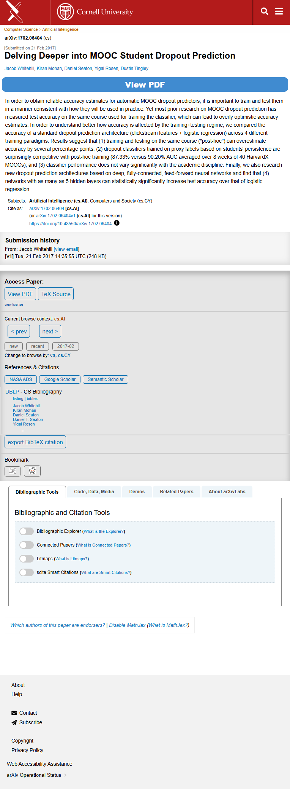

# Page text dump

Source: https://arxiv.org/abs/1702.06404



```
Skip to main content
Computer Science > Artificial Intelligence
arXiv:1702.06404 (cs)
[Submitted on 21 Feb 2017]
Delving Deeper into MOOC Student Dropout Prediction
Jacob Whitehill, Kiran Mohan, Daniel Seaton, Yigal Rosen, Dustin Tingley
View PDF
In order to obtain reliable accuracy estimates for automatic MOOC dropout predictors, it is important to train and test them in a manner consistent with how they will be used in practice. Yet most prior research on MOOC dropout prediction has measured test accuracy on the same course used for training the classifier, which can lead to overly optimistic accuracy estimates. In order to understand better how accuracy is affected by the training+testing regime, we compared the accuracy of a standard dropout prediction architecture (clickstream features + logistic regression) across 4 different training paradigms. Results suggest that (1) training and testing on the same course ("post-hoc") can overestimate accuracy by several percentage points; (2) dropout classifiers trained on proxy labels based on students' persistence are surprisingly competitive with post-hoc training (87.33% versus 90.20% AUC averaged over 8 weeks of 40 HarvardX MOOCs); and (3) classifier performance does not vary significantly with the academic discipline. Finally, we also research new dropout prediction architectures based on deep, fully-connected, feed-forward neural networks and find that (4) networks with as many as 5 hidden layers can statistically significantly increase test accuracy over that of logistic regression.
Subjects:	Artificial Intelligence (cs.AI); Computers and Society (cs.CY)
Cite as:	arXiv:1702.06404 [cs.AI]
 	(or arXiv:1702.06404v1 [cs.AI] for this version)
 	
https://doi.org/10.48550/arXiv.1702.06404
Focus to learn more
Submission history
From: Jacob Whitehill [view email]
[v1] Tue, 21 Feb 2017 14:35:55 UTC (248 KB)

Access Paper:
View PDFTeX Source
view license
Current browse context: cs.AI
< prev next >

new recent 2017-02
Change to browse by: cs cs.CY
References & Citations
NASA ADS
Google Scholar
Semantic Scholar
DBLP - CS Bibliography
listing | bibtex
Jacob Whitehill
Kiran Mohan
Daniel Seaton
Daniel T. Seaton
Yigal Rosen
…
export BibTeX citation
Bookmark
 
Bibliographic Tools
Bibliographic and Citation Tools
Bibliographic Explorer Toggle
Bibliographic Explorer (What is the Explorer?)
Connected Papers Toggle
Connected Papers (What is Connected Papers?)
Litmaps Toggle
Litmaps (What is Litmaps?)
scite.ai Toggle
scite Smart Citations (What are Smart Citations?)
Code, Data, Media
Demos
Related Papers
About arXivLabs
Which authors of this paper are endorsers? | Disable MathJax (What is MathJax?)
About
Help
Contact
Subscribe
Copyright
Privacy Policy
Web Accessibility Assistance

arXiv Operational Status 
```
