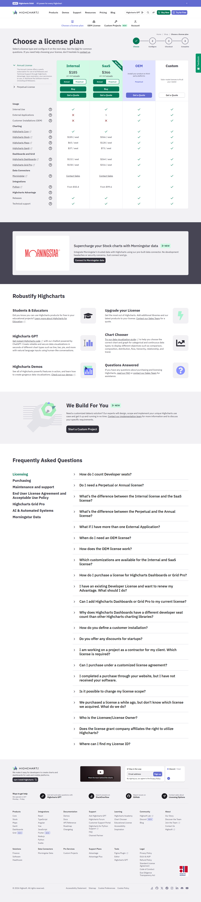

# Highcharts pricing

**Claim** (оновлено в PROJECT_VISION.md): "Highcharts non-commercial безкоштовно (CC BY-NC); Annual License від $185/seat/рік; Perpetual License від $366/seat. Окремі модулі (Stock, Maps, Gantt) дешевші — від $37/seat annual."
**Source**: https://shop.highcharts.com/
**Captured**: 2026-05-09
**Verdict**: `confirmed`.



## Verification (з [text.md](text.md))

Single Developer license, Highcharts core:
```
Annual License:    $185 / seat
Perpetual License: $366 / seat
```

Інші продукти (Stock, Maps, Gantt, Dashboards тощо):
```
$65 / seat (annual)    /  $128 / seat (perpetual)
$37 / seat             /  $73 / seat
$132 / seat            /  $264 / seat
$158 / seat            /  $316 / seat
"From $50.4" / "From $99.6"  (для education)
```

## Notes

- **Найдешевша Annual ліцензія** на Highcharts core — **$185/seat**, не $500.
- Perpetual: $366/seat.
- Окремі модулі (Stock, Maps, Gantt) — від $37 до $158 за seat annual.
- Документ треба оновити: "від $185/рік за developer seat (Annual core)" або зняти Highcharts з обговорення взагалі — ми все одно беремо OSS бібліотеки (Recharts/D3/ECharts).
- Non-commercial use дійсно безкоштовний (CC BY-NC).
