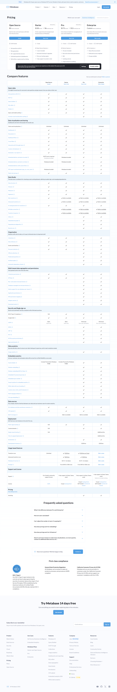

# Metabase Cloud pricing

**Claim** (оновлено в PROJECT_VISION.md): "Metabase — open-source AGPL self-host безкоштовно; Cloud Starter $100/міс + $6/user (5 users included); Cloud Pro $575/міс + $12/user; Enterprise від $20k/рік."
**Source**: https://www.metabase.com/pricing/
**Captured**: 2026-05-09
**Verdict**: `confirmed`.



## Verification

Скріншот ([screenshot.png](screenshot.png)) показує всі плани. WebFetch на ту ж URL повертає:

```
Starter:    $100 /month + $6 /month per user (5 users included)
Pro:        $575 /month + $12 /month per user (10 users included)
Enterprise: From $20k/year
```

Open-source self-host: AGPL ліцензія, $0 (підтверджено у [text.md](text.md) рядок з `License AGPL`).

## Notes

- **Open-source self-host** — підтверджено безкоштовно (AGPL).
- **Cloud Starter**: тепер **$100/міс** з 5 юзерами + $6/міс за додаткового. Документ говорить "~$85+/міс" — близько, але потрібно оновити до $100.
- **Cloud Pro**: $575/міс + $12/user (10 included).
- **Enterprise**: від $20k/рік.
- Тобто для embedded analytics на старті — або self-host AGPL (безкоштовно, але тягнеш правовий обовʼязок з AGPL), або Cloud Starter $100/міс.
