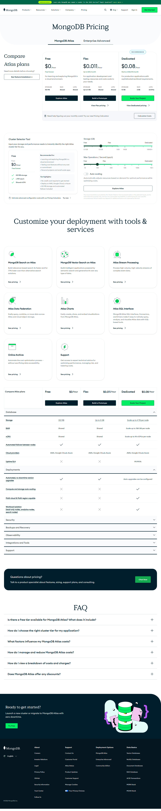

# Page text dump

Source: https://www.mongodb.com/pricing



```
___
ANNOUNCEMENT
Learn why MongoDB was named a Leader in the 2025 Gartner® Magic Quadrant™ Learn more >
Products
Resources
Solutions
Company
Pricing
Eng
Support
Sign In
Get Started
MongoDB Pricing
MongoDB Atlas
Enterprise Advanced

Compare Atlas plans

Need more details before choosing?

See feature breakdown ↓

Free

$0

/hour

Free forever

For learning and exploring MongoDB in a cloud environment.

STORAGE

512 MB

RAM

Shared

vCPU

Shared

Explore Atlas

Flex

$0.011

/hour

Up to $30/month

For application development and testing; resources and costs scale to your needs.

STORAGE

Up to 5 GB

RAM

Shared

vCPU

Shared

Build a Prototype
View Flex pricing

Dedicated

$0.08

/hour

Starts at $56.94/month

For production applications with sophisticated workload requirements.

STORAGE

10 GB

RAM

2 GB

vCPU

2vCPUs

Scale Your Project
View Dedicated pricing

Need help figuring out your monthly costs? Try our new Pricing Calculator

Calculate Costs

Cluster Selector Tool

Input your storage and performance needs to instantly identify the right Atlas cluster tier for you.

Free

From

$0
/hour

Free forever

512 MB storage

≤ 100 ops/s

Shared vCPU

Recommended for:

Learning and exploring MongoDB in a cloud environment
Testing core features without any cost or commitment
Personal projects and small-scale apps

Tier highlights:

No credit card required to get started
Deploy on AWS, Google Cloud, or Azure
512 MB storage and automated failover included

Estimate advanced configuration costs with our Pricing Calculator.

Trynow
Storage (GB)
Free
Flex
Dedicated
0.1GB
0.5GB
5GB
10GB
100GB+
Max Operations / Second (ops/s)
Free
Flex
Dedicated
10
100
500
10K
100K
1M+
Auto-scaling

Automatically adjusts resources based on demand for optimal performance while optimizing costs.

Explore Atlas

The recommendations provided by the Cluster Selector Tool are based solely on the selected inputs, are for informational purposes only, and are not a guarantee of suitability or performance for your specific circumstances. Actual needs may depend on additional factors not captured by this tool.

Customize your deployment with tools & services

MongoDB Search on Atlas

Build relevance-based search 4x faster and for 77% lower cost than alternative search solutions.

See pricing

MongoDB Vector Search on Atlas

Build intelligent applications powered by semantic search and generative AI over any type of data.

See pricing

Atlas Stream Processing

Process high-volume, high-velocity streams of complex event data.

See pricing

Atlas Data Federation

Easily query, combine, or move data across Atlas and cloud object storage.

See pricing

Atlas Charts

Easily create, share, and embed visualizations from MongoDB Atlas.

See pricing

Atlas SQL Interface

MongoDB Atlas SQL Interface, Connectors, and Drivers make it easy to natively query, analyze, and visualize Atlas data with SQL-based tools.

See pricing

Online Archive

Automate the cost optimization process — without sacrificing data accessibility.

See pricing

Support

Get access to expert technical advice for optimizing performance, managing risk, and lowering costs.

See pricing

Compare Atlas plans

Free

$0

/hour

Explore Atlas

Flex

$0.011

/hour

Build a Prototype

Dedicated

$0.08

/hour

Scale Your Project
Database
Storage
512 MB
Up to 5 GB
Scale up to 4 TB per node
RAM
Shared
Shared
Scale up to 768 GB per node
vCPU
Shared
Shared
Scale up to 96 vCPUs per node
Automated failover between nodes
Cloud providers
AWS, Google Cloud, Azure
AWS, Google Cloud, Azure
AWS, Google Cloud, Azure
Uptime SLA
99.995%
Deployments
Automated, no downtime version upgrades
Auto-upgrades can be configured
Compute and storage auto-scaling
Multi-cloud & Multi-region capable
Workload isolation
(read-only nodes, analytics nodes, search nodes)
Security
Backups and Recovery
Observability
Integrations and Tools
Support

Questions about pricing?

Talk to a product specialist about features, sizing, support plans, and consulting.

Chat Now
FAQ

Is there a free tier available for MongoDB Atlas? What does it include?

How do I choose the right cluster tier for my application?

What factors influence my MongoDB Atlas costs?

How do I manage and reduce MongoDB Atlas costs?

How do I view a breakdown of costs and charges?

Does MongoDB Atlas offer any discounts?

Ready to get started?

Launch a new cluster or migrate to MongoDB Atlas with zero downtime.

Try Free
Free Cluster
Pay-as-you-go! Clusters are billed hourly with monthly invoices.
Amazon Web Services

Microsoft Azure

Google Cloud

Cluster Tier
Storage
RAM
vCPUs
Base Price
M0
512 MB
Shared
Shared
Free forever
M2
2 GB
Shared
Shared
$9/mo
M5
5 GB
Shared
Shared
$25/mo
Dedicated Cluster
Pay-as-you-go! Clusters are billed hourly with monthly invoices.
Amazon Web Services

Microsoft Azure

Google Cloud

Cluster Tier
Storage
RAM
vCPU
Base Price
M10
10–128 GB
2 GB
2 vCPUs
$0.08/hr
M20
20–256 GB
4 GB
2 vCPUs
$0.20/hr
M30
40–512 GB
8 GB
2 vCPUs
$0.54/hr
M40
80 GB–1 TB
16 GB
4 vCPUs
$1.04/hr
M50
160 GB–4 TB
32 GB
8 vCPUs
$2.00/hr
M60
320 GB–4 TB
64 GB
16 vCPUs
$3.95/hr
M80
750 GB–4 TB
128 GB
32 vCPUs
$7.30/hr
M140
1–4 TB
192 GB
48 vCPUs
$10.99/hr
M200
1.5–4 TB
256 GB
64 vCPUs
$14.59/hr
M300
2–4 TB
384 GB
96 vCPUs
$21.85/hr
M400
3–4 TB
488 GB
64 vCPUs
$22.40/hr
M700
4 TB
768 GB
96 vCPUs
$33.26/hr
Additional hardware configurations available for specialized workloads including Low-CPU and Local NVMe SSD. Scale beyond 4 TB: Sharded clusters offer additional compute and storage through horizontal scaling.

The pricing provided is based on the default storage listed. Actual pricing can vary based on deployment requirements, configurations, and location. See Atlas Cluster Configuration Costs and Customize Cluster Storage.

Flex Cluster
Pay as you go! Clusters are billed hourly with monthly invoices. Flex clusters are priced based on usage and can cost between $8 and $30 for a month’s usage.
Amazon Web Services

Microsoft Azure

Google Cloud

Tier (ops/second)
Total Hourly Cost
Total Monthly Cost*
0 - 100 (Base)
$0.0110
$8.00
100 - 200
$0.0205
$15.00
200 - 300
$0.0288
$21.00
300 - 400
$0.0356
$26.00
400 - 500
$0.0411
$30.00

*Assuming continuous usage at a specific tier for 30 days. For more information and pricing examples, see documentation.

Atlas SQL Interface

Atlas SQL Interface leverages Atlas Data Federation as its query engine, making it easy and fast to analyze your application and cloud data together using a single API. Pricing is based on data processed, transferred, and returned.

Data Processed
Data Transferred and returned
$5 per TB with a 10MB minimum per query
Data transfer costs are based on the rates set by your cloud service provider
Atlas Data Lake

Atlas Data Lake is a fully managed storage solution optimized for analytical queries at the cost of cloud object storage. The pricing for storing and accessing data varies based on the AWS region. The prices are as follows:

Data Lake Regions
AWS Regions
Price per GB per Month
Per 1,000 Partition Accesses
Virginia, USA
us-east-1
0.048
0.0010
Oregon, USA
us-west-2
0.048
0.0010
Sao Paulo, Brazil
sa-east-1
0.0845
0.0015
Ireland
eu-west-1
0.048
0.0010
London, England
eu-west-2
0.0501
0.0011
Frankfurt, Germany
eu-central-1
0.0511
0.0011
Mumbai, India
ap-south-1
0.0522
0.0010
Singapore
ap-southeast-1
0.0522
0.0010
Sydney, Australia
ap-southeast-2
0.0522
0.0011
Online Archive
Automate data tiering with MongoDB Atlas Online Archive. Scale your storage and optimize costs while keeping data accessible.
Amazon Web Services

Microsoft Azure

Google Cloud

Americas

Asia Pacific

Europe & Middle East

Region
Data Storage
Time Series Data Storage
Archival Access
Data Process
US East (N. Virginia)
0.001578
0.0032
0.0010000
$5 per TB Processed
US West (Oregon)
0.001578
0.0032
0.0010000
"
Canada (Central)
0.001715
0.00348
0.0011000
"
South America (Sao Paulo)
0.002779
0.005634
0.0014000
"
Legacy Regions
Americas

Asia Pacific

Europe & Middle East

Region
Data Storage
Time Series Data Storage
Archival Access
Data Process
US East (Ohio)
0.001578
0.0032
0.0010000
"
US West (N. California)
0.001784
0.00362
0.0011000
"
Customers with existing deployments in legacy regions can continue to access their data, but new archives cannot be created in these regions.
Atlas Charts

Atlas Charts helps you quickly spot trends, uncover meaningful insights, and understand your data on a deeper level. Charts is included on all Atlas clusters, with premium features available on Dedicated and Flex clusters.

Feature
M0 Clusters
Dedicated Clusters
Dashboard & chart refreshes
1 auto-refresh every 4 hours*
Unlimited
Email reports
Users can only run weekly reports**
Unlimited
Natural language charts
iFrame embedding
Dashboard and chart refresh limit applies
No refresh limits
Password-protected public dashboard
Manual refresh
—

For more information on Charts pricing, please visit our documentation. Atlas usage is additional and not included in the above pricing.

*Limit does not apply to chart builder, dashboard filters, natural language charts, or the embedding SDK.

**Reports are limited to one per week.

Atlas Data Federation

Atlas Data Federation is a serverless, scalable query engine that makes it simple and fast to analyze your application and cloud data together using a single API. Pricing is based on data processed, transferred, and returned.

Data Processed
Data transferred and returned
$5 per TB with a 10MB minimum per query
Data transfer costs are based on the rates set by your cloud service provider
App Services

All App Services in an Atlas project share a monthly free tier: 1 million requests or 500 hours of compute, or 10,000 hours of sync runtime (whichever occurs first), plus 10 GB of data transfer. Usage below these thresholds in a given month is not billed. Once the sum of all application usage in a project exceeds the free-tier threshold, Atlas begins billing for additional usage.

Compute
Sync
Request
Transfer
$10/500 hours of request runtime Excluding Sync
$0.08/1M minutes of Sync runtime
$2.00/1M application requests
$0.12/GB for egress
$0.000000005/ms
$0.00000008/min
$0.000002/request
$0.12/GB for egress
Applicable services include Triggers, Functions, GraphQL API, and Device Sync.
MongoDB Search on Atlas

Build engaging, modern applications with the power of full-text and semantic search. High CPU is the recommended configuration for Atlas Search.

Cluster Tier
Storage
vCPUs
RAM
Base Price
S20
100 GB
2
4
$0.13/hr
S30
200 GB
4
8
$0.24/hr
S40
380 GB
8
16
$0.46/hr
S50
760 GB
16
32
$0.91/hr
S60
1600 GB
32
64
$1.64/hr
S70
3200 GB
48
96
$2.47/hr
S80
6400 GB
64
128
$3.27/hr
S140
Not offered
Not offered
Not offered
Not offered
S200
Not offered
Not offered
Not offered
Not offered
S300
Not offered
Not offered
Not offered
Not offered
S400
Not offered
Not offered
Not offered
Not offered
Atlas Search offers both High CPU and Low CPU pricing, please [view our full pricing] for more.
MongoDB Search on Atlas
Build engaging, modern applications with dedicated architecture for full-text and semantic search use cases, delivering better performance at scale and higher availability. Available on AWS, Google Cloud and Microsoft Azure.
Amazon Web Services

Google Cloud

Microsoft Azure

High CPU Nodes

Low CPU Nodes

Storage-Optimized Nodes

Cluster Tier
Storage (GB)
RAM (GB)
vCPUs
Base Price
S20
106 GB
4 GB
2 vCPUs
$0.12/hr
S30
213 GB
8 GB
4 vCPUs
$0.24/hr
S40
426 GB
16 GB
8 vCPUs
$0.48/hr
S50
855 GB
32 GB
16 vCPUs
$0.99/hr
S60
1710 GB
64 GB
32 vCPUs
$1.77/hr
S70
2564 GB
96 GB
48 vCPUs
$2.50/hr
S80
3420 GB
128 GB
64 vCPUs
$3.26/hr
MongoDB Vector Search on Atlas
Build engaging, modern applications with dedicated architecture for full-text and semantic search use cases, delivering better performance at scale and higher availability. Available on AWS, Google Cloud and Microsoft Azure.
Amazon Web Services

Google Cloud

Microsoft Azure

High CPU Nodes

Low CPU Nodes

Storage-Optimized Nodes

Cluster Tier
Storage (GB)
RAM
vCPUs
Base Price
S20
106 GB
4 GB
2 vCPUs
$0.12/hr
S30
213 GB
8 GB
4 vCPUs
$0.24/hr
S40
426 GB
16 GB
8 vCPUs
$0.48/hr
S50
855 GB
32 GB
16 vCPUs
$0.99/hr
S60
1710 GB
64 GB
32 vCPUs
$1.77/hr
S70
2564 GB
96 GB
48 vCPUs
$2.50/hr
S80
3420 GB
128 GB
64 vCPUs
$3.26/hr
Stream Processors
Transform building event-driven applications that react and respond continuously and unify how you work with data-in-motion and data-at-rest.
Amazon Web Services

Microsoft Azure

Google Cloud

Stream Processor Tier
vCPU
RAM
Bandwidth
Max Parallelism
Cost Per Hour*
SP2
0.25
512 MB
50 Mbps
1
$0.06 to $0.08
SP5
0.5
1 GB
125 Mbps
2
$0.11 to $0.17
SP10
1
2 GB
200 Mbps
8
$0.19 to $0.30
SP30
2
8 GB
750 Mbps
16
$0.39 to $0.62
SP50
8
32 GB
2500 Mbps
64
$1.56 to $2.49
*Data transfer costs are not included in the above pricing.

For more information on Stream Processing pricing, please visit our documentation.

English
© 2026 MongoDB, Inc.

About

Careers
Investor Relations
Legal
Privacy Policy
GitHub
Security Information
Trust Center
Follow Us

Support

Contact Us
Customer Portal
Atlas Status
Product Updates
Customer Support
Manage Cookies
Your Privacy Choices

Deployment Options

MongoDB Atlas
Enterprise Advanced
Community Edition

Data Basics

Vector Databases
NoSQL Databases
Document Databases
RAG Database
ACID Transactions
MERN Stack
MEAN Stack
 
```
