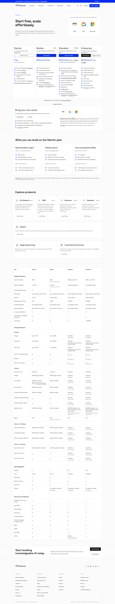

# Pinecone pricing

**Claim** (оновлено в PROJECT_VISION.md): "Pinecone — Starter free (Dense/Sparse/Full-Text indexes); Builder $20/міс flat; Standard від $50/міс мін.; Enterprise від $500/міс."
**Source**: https://www.pinecone.io/pricing/
**Captured**: 2026-05-09
**Verdict**: `confirmed`.



## Verification (з [text.md](text.md))

```
Free (Starter): "Start for Free", "Dense, Sparse, and Full-Text Indexes"
Builder:        $20/month flat
Standard:       $50/month min. usage  (pay-as-you-go після порогу)
Enterprise:     $500/month min. usage
```

## Notes

- **Free tier**: тепер називається **Starter**, дозволяє Dense + Sparse + Full-Text Indexes (не "1 index", як у нас написано).
- **Платний старт**: **$20/міс** flat (Builder) або **$50/міс minimum** (Standard) з PAYG.
- Цифра "$70/міс" з документа не відповідає жодному поточному тарифу. Потрібно замінити на `$20/міс (Builder)` або `$50/міс мін. (Standard)` залежно від того, що ближче по фічах.
- На сторінці також є детальна PAYG-таблиця ($0.33/GB/mo storage; $4–$4.50 per million queries у Standard).
