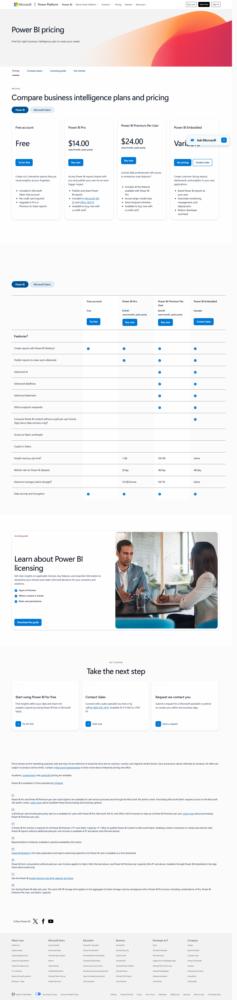

# Power BI pricing

**Claim** (оновлено в PROJECT_VISION.md): "Power BI Pro $14/user/міс (paid yearly); Premium Per User $24/user/міс; embedded окремо через Fabric F-SKU."
**Source**: https://www.microsoft.com/en-us/power-platform/products/power-bi/pricing
**Captured**: 2026-05-09
**Verdict**: `confirmed`.



## Verification (з [text.md](text.md))

```
Power BI Pro                 $14.00  user/month, paid yearly
Power BI Premium Per User    $24.00  user/month, paid yearly
```

## Notes

- **Pro**: тепер **$14/user/міс** (paid yearly). Документ говорить ~$10 — застаріло.
- **Premium Per User**: $24/user/міс.
- Free tier є тільки в межах Microsoft Fabric.
- Embedded — окрема ліцензія через Fabric F-SKU або Premium P-SKU (на сторінці `F64 and above` згадано).
