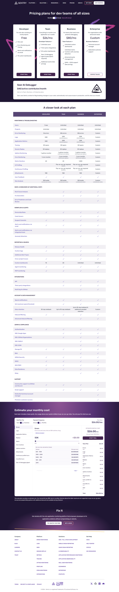

# Page text dump

Source: https://sentry.io/pricing/



```
Skip to main content
PLATFORM
SOLUTIONS
RESOURCES
DOCS
PRICING
SIGN IN
GET DEMO
GET STARTED
Pricing plans for dev teams of all sizes

Monthly

Annual

Save with annual

Developer

For solo devs working on small projects

Free

One user

Error Monitoring and Tracing

Alerts and notifications via email

10 custom dashboards

START TRIAL
Team

Everything to monitor your application as it scales

$26/mo

Developer features +

Unlimited users

Third-party integrations

20 custom dashboards

Seer: AI debugging agent (subscription required)

Additional events (See pricing)

START TRIAL
Business

For teams that need more powerful debugging

$80/mo

Team features +

Unlimited custom dashboards

Unlimited metric monitors with anomaly detection

Advanced quota management

SAML + SCIM support (See pricing)

START TRIAL
Enterprise

For organizations with advanced needs

Custom

Business features +

Technical account manager

Dedicated customer support

CONTACT SALES
Seer AI Debugger
$40/active contributor/month
Add on to Team, Business, or Enterprise plans

Seer uses Sentry context to flag breaking changes in your code, automatically root cause issues in production, and fix what you missed.

A closer look at each plan
DEVELOPER
TEAM
BUSINESS
ENTERPRISE
MONITORING & TROUBLESHOOTING
Users
1 User
Unlimited
Unlimited
Unlimited
Projects
Unlimited
Unlimited
Unlimited
Unlimited
Error Monitoring
5k errors
50k errors
50k errors
Custom
Logs
5GB
5GB
+$0.50/GB additional
5GB
+$0.50/GB additional
Custom
Application Metrics
5GB
5GB
+$0.50/GB additional
5GB
+$0.50/GB additional
Custom
Tracing
5M spans
5M spans
5M spans
Custom
Session Replay
50 replays
50 replays
50 replays
Custom
Uptime Monitoring
1 uptime monitor
1 uptime monitor
+$1.00/uptime alert additional
1 uptime monitor
+$1.00/uptime alert additional
Custom
Cron Monitoring
1 cron monitor
1 cron monitor
+$0.78/monitor additional
1 cron monitor
+$0.78/monitor additional
Custom
Metric Monitors
20
20
1,000
Custom
UI Profiling
Pay-as-you-go required
+$0.25/hr
Pay-as-you-go required
+$0.25/hr
Custom
Continuous Profiling
Pay-as-you-go required
+$0.0315/hr
Pay-as-you-go required
+$0.0315/hr
Custom
Attachments
1GB
1GB
1GB
Custom
User Feedback
Size Analysis
100 builds
+unlimited build monitors
100 builds
+unlimited build monitors
100 builds
+unlimited build monitors
Custom
+unlimited build monitors
SEER: AI DEBUGGER (AT ADDITIONAL COST)
Root Cause Analysis
Fix Generation
Error Prediction and Code Review
WORKFLOW & ALERTS
Ownership Rules
Code Owners
Suspect Commits
Alerts and notifications via email
Alerts and notifications via integrated tools
Anomaly Detection
REPORTING & SEARCH
Release Health
Custom tags
Additional Alert Types
Cross-project issues
Custom dashboards
10
20
Unlimited
Unlimited
Agent monitoring
MCP monitoring
INTEGRATIONS
API
Third-party integrations
Multi Org for GitHub
ACCOUNT & DATA MANAGEMENT
Spend notifications
Set maximum spend threshold
Data retention
30-day lookback
Up to 90-day lookback
Up to 90-day lookback & additional sampled retention
Custom
Inbound filtering
Advanced inbound filtering
ADMIN & COMPLIANCE
Authentication
SSO: Google Apps
SSO: GitHub Organizations
SSO: SAML2
SSO: SCIM
Manage PII
BAA
HIPAA Security
SOC2
ISO 27001
Data Residency
Relay
SUPPORT
Community support via GitHub and Discord
Email support
Dedicated technical account manager
Premium customer success
Estimate your monthly cost

Each plan includes a base quota. Any usage above your quota is billed at pay-as-you-go rates. You only pay for what you use.

Paid Plan Tier

Team

Business

Payment Frequency

Annual

Monthly

Plan Base
$26.00/mo
Errors
Logs
Application Metrics
Replays
Spans
Cron monitors
Uptime monitors
Attachments
Continuous profile hours
UI profile hours
Seer: AI Debugging Agent
Errors

Errors are sent every time an SDK catches a bug.

50K/mo included
50K
+$0.00
50K
1B

PAY-AS-YOU-GO RATES (TEAM)

Volume	Price per error
50K – 100K	$0.0003625
100K – 500K	$0.0002188
500K – 10M	$0.0001875
10M – 20M	$0.0001625
20M+	$0.0001500
← Previous
Logs →
ESTIMATED MONTHLY COST
$26.00/mo

Annual total: $312.00/yr

START TRIAL
Team Plan
$26.00
Errors
50K
$0.00
Logs
5 GB
$0.00
Application Metrics
5 GB
$0.00
Replays
50
$0.00
Spans
5M
$0.00
Cron monitors
1
$0.00
Uptime monitors
1
$0.00
Attachments
1 GB
$0.00
Cont. profile hrs
0 hr
$0.00
UI profile hrs
0 hr
$0.00
Seer
0
$0.00
Total
$26.00/mo

This calculator provides an estimate only. Your actual bill may differ due to rounding. Volumes above the slider maximums are supported on pay-as-you-go plans. Annual and prepaid billing options with additional discounts are available during checkout.

Fix It

Get started with the only application monitoring platform that empowers developers to fix application problems without compromising on velocity.

TRY SENTRY FOR FREE
GET A DEMO
Company
ABOUT
BLOG
CAREERS
CONTACT US
TRUST
Platform
ERROR MONITORING
LOGS
SEER
SESSION REPLAY
METRICS
TRACING
UPTIME MONITORING
PROFILING
CRON MONITORING
INTEGRATIONS
Solutions
WEB / FULL STACK DEVELOPMENT
MOBILE CRASH REPORTING
GAME CRASH REPORTING
AI OBSERVABILITY
APPLICATION PERFORMANCE MONITORING
APPLICATION OBSERVABILITY
REAL USER MONITORING
ECOMMERCE
ENTERPRISE
STARTUPS
Get Help
DOCS
HELP CENTER
STATUS
DEV RESOURCES
TERMS
SECURITY & COMPLIANCE
PRIVACY
Twitter Menu Button
Github Social Menu Button
LinkedIn Menu Button
Discord Menu Button
© 2026 • Sentry is a registered Trademark of Functional Software, Inc.
```
