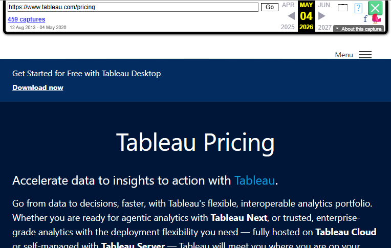

# Page text dump

Source: https://www.tableau.com/pricing/teams-orgs



```
Menu

Get Started for Free with Tableau Desktop

Download now
Tableau Pricing
Accelerate data to insights to action with Tableau.

Go from data to decisions, faster, with Tableau's flexible, interoperable analytics portfolio. Whether you are ready for agentic analytics with Tableau Next, or trusted, enterprise-grade analytics with the deployment flexibility you need — fully hosted on Tableau Cloud or self-managed with Tableau Server — Tableau will meet you where you are on your analytics journey!

Get started today – for free!

Choose the right solution for your team.
Tableau Cloud
Tableau Server
Tableau Next
Deliver data-driven insights at scale with a fully hosted AI-powered analytics platform

This solution requires an annual contract, billed annually. Every deployment requires at least one Creator license. For additional users, Creator, Explorer, and Viewer licenses are available. Learn more in the comparison tables below.

Currency converter 
US Dollar (USD)
Australian Dollar (AUD)
British Pound (GBP)
Euro (EUR)
Japanese Yen (JPY)
Swedish Krona (SEK)
Tableau

A comprehensive edition to help you explore and understand your data.

Starting at:

$
15
USD/User/Month
(Billed annually)
Author, govern, and collaborate with browser-based web authoring
Tableau Desktop and Prep Builder
Tableau Pulse
Buy now
Tableau Enterprise

An advanced edition to help you manage, secure, and scale your data and analytics.

Starting at:

$
35
USD/User/Month
(Billed annually)
Includes everything in Tableau Standard, plus:
Advanced Management and Data Management
Buy now
Tableau+ Bundle
A bundle to help you enhance your data and analytics workflows with AI and additional support.*
Contact Sales
Includes everything in Tableau Enterprise, plus:
Tableau Next, Tableau Agent and Pulse premium features
Release Preview
Contact Sales

* This solution requires an annual contract, billed annually. Every deployment requires at least one Creator license. For additional users, Creator, Explorer, and Viewer licenses are available.

Get started for free today

Unlock best in class visual analytics with Tableau Desktop Free Edition. Analyze Excel, CSV, and database files with Tableau's full authoring capabilities, all stored locally on your machine. When you're ready to collaborate and scale, upgrade to Tableau Cloud for seamless sharing, governance, and enterprise features.

Download free
Choose your edition and user licenses.
Compare Tableau Cloud and Server Editions and the Tableau+ Bundle*
Standard Edition
Enterprise Edition
Tableau+ Bundle*
All Solutions
Author, govern, and collaborate
✅
✅
✅
Tableau Prep Builder
✅
✅
✅
Tableau Desktop
✅
✅
✅
Data Management
✅
✅
Advanced Management
✅
✅
eLearning
✅
✅
Tableau Cloud
Tableau Pulse
✅
✅
✅
Sites with Tableau Cloud Manager**
✅
Up to 3 sites
✅
Up to 10 sites
✅
Up to 50 sites
Tableau Agent***
✅
Pulse premium features
✅
Premier Success
✅
Tableau Next
Data 360
✅
Tableau Semantics
✅
Agentforce Skills
✅

* A premium bundle only available with Tableau Cloud and includes Tableau Next

** Unlimited sites with Tableau Server

*** Tableau Agent is available on all Server Editions

* At least one Creator license of Tableau Cloud needed per deployment, for one person.

Tableau helps increase confidence in our clients' decision making based on facts and data, further strengthening our client relationships.
Erik Vandermause
Applied Intelligence VP, M3 Insurance
See the story
Find answers to your frequently asked questions.
Tableau Cloud
Tableau Server
Tableau Next
Tableau Desktop
What are the main product offerings in the Tableau portfolio?

The Tableau portfolio offers three key products designed to meet diverse analytic needs: Tableau Cloud, Tableau Server, and Tableau Next. The Tableau Cloud deployment option offers a fully hosted analytics solution.

What editions and user licenses are available for Tableau Cloud, and how are they priced?
Does Tableau Cloud have a consumption-based pricing component in addition to the Role-based Licensing?
What is the purpose of the Viewer, Explorer, and Creator license types?
What are the key capabilities included in each Tableau Cloud edition?
Does Tableau offer support and training resources?

Try for free

What is Tableau?
Agentic Analytics
Build a Data Culture
Data Analytics Insights
Tableau Research
Contact Us
Tableau Community
Tableau Public
Tableau User Groups
Community Leaders
DataDev
Community Projects
Tableau Neighborhood
Academic Programs
Events
Partners
Find a partner
Become a partner
Support
Knowledge Base
Learning and Certification
Tableau Help
All Releases
English (US) 
Deutsch
English (UK)
English (US)
Español
Français (Canada)
Français (France)
Italiano
日本語
한국어
Nederlands
Português
Svenska
ไทย
简体中文
繁體中文
Trust Blog Developer Contact Us
Legal Terms Of Service Privacy Information Responsible Disclosure Cookie Preferences Your Privacy Choices
LinkedIn
 
Facebook
 
Twitter
© Copyright 2026 Salesforce, Inc. All rights reserved. Various trademarks held by their respective owners. Salesforce, Inc. Salesforce Tower, 415 Mission Street, 3rd Floor, San Francisco, CA 94105, United States
```
